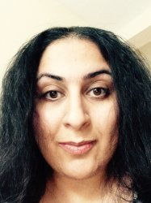
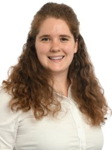
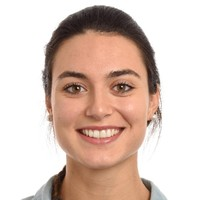
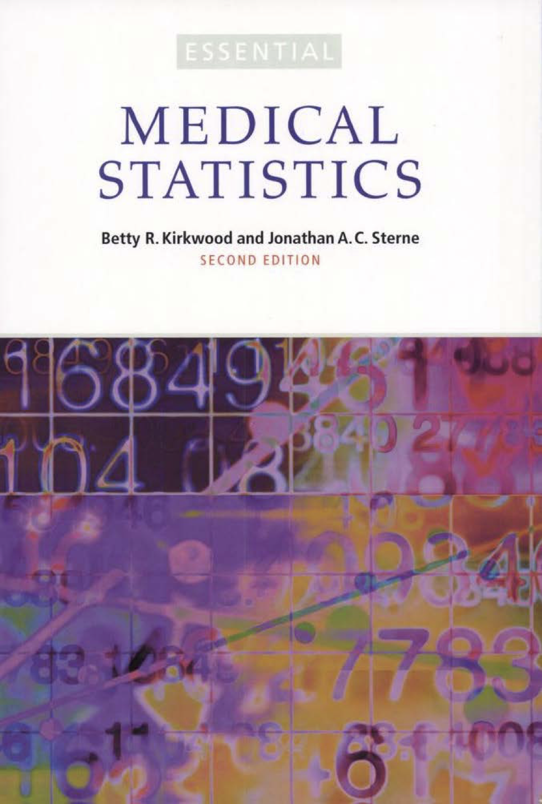
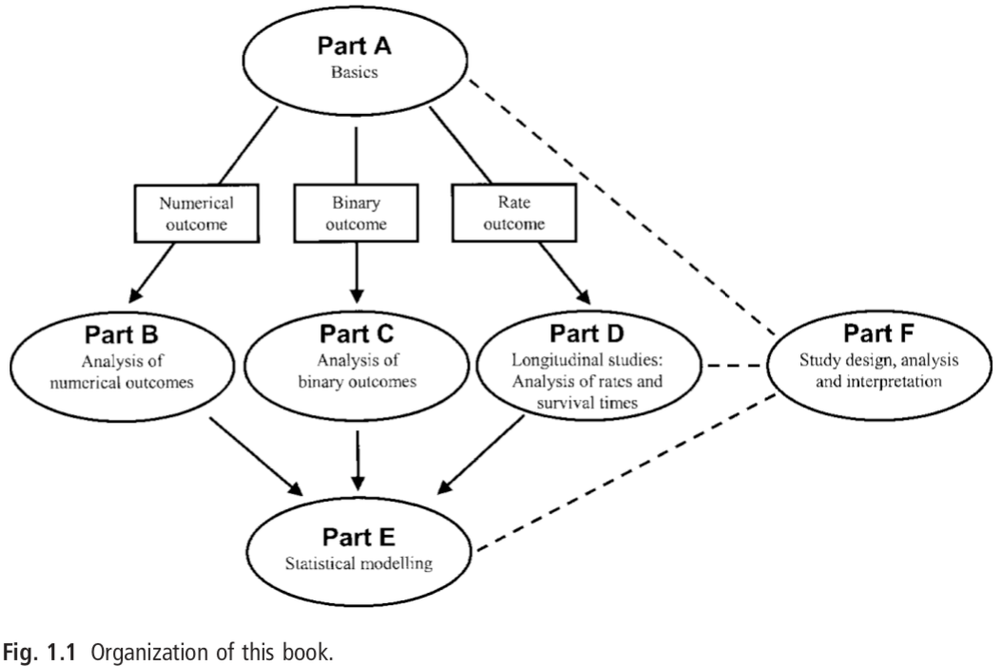
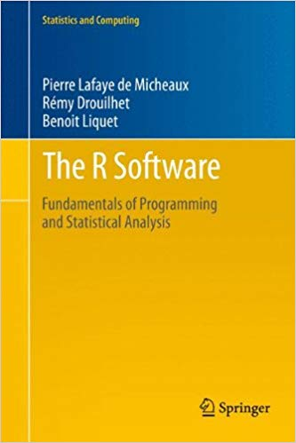

<style>
.forceBreak { -webkit-column-break-after: always; break-after: column; }
</style>

<style>
div.footnotes {
  position: absolute;
  bottom: 0;
  margin-bottom: 10px;
  width: 80%;
  font-size: 0.6em;
}
</style>

<script src="https://ajax.googleapis.com/ajax/libs/jquery/3.1.1/jquery.min.js"></script>
<script>
$(document).ready(function() {
  $('slide:not(.backdrop):not(.title-slide)').append('<div class=\"footnotes\">');

  $('footnote').each(function(index) {
    var text  = $(this).html();
    var fnNum = (index+1).toString();
    $(this).html("".sup());

    var footnote   = text + '<br/>';
    var oldContent = $(this).parents('slide').children('div.footnotes').html();
    var newContent = oldContent + footnote;
    $(this).parents('slide').children('div.footnotes').html(newContent);
  });
});
</script>


```{r include = FALSE}
knitr::opts_chunk$set(echo = FALSE)
library(viridis)
```
## Introduction to Statistical Thinking<br>and Data Analysis


__Statistics__ is the science of 

* _collecting_, 
* _summarizing_, 
* _presenting_ and 
* _interpreting_ **data**, 

and of using them to 

* _estimate the magnitude of associations_ and 
* _test hypotheses._<footnote>Kirkwood and Sterne, page 1.</footnote>

## Course Objectives {.build}

<div>
* Understand the principles and interpretation of statistical inference, sampling from a population, confidence intervals, and hypothesis testing.
</div>

<div>
* Have knowledge of the **assumptions** and appropriate **application** of statistical methods commonly used in epidemiological analyses, including:
  * t-tests, linear regression, logistic regression, survival analysis, and handling missing data.
</div>

<div>
* Learn and apply the **R language** for data manipulation, visualization, and statistical analysis.
</div>

<div>
* Gain experience manipulating and analyzing real-world data sets, and **preparing**, **interpreting** and **communicating** statistical analyses.
</div>

## Course structure {.build}

<div>


* __Monday 10:00-11:00:__ Tutorial sheet review
* __Monday 11:15-12:15:__ Lecture
  * Dr. Jeff Eaton, Dr. Fred Piel, Dr. David Muller
</div>

<div>
<br>



* __Monday 14:00-15:30:__ Applied Statistics Lab
  * Dr. Deborah Schneider-Luftman, Dr. Raha Pazoki
</div>

<div>
<br>


* __Wednesday 9:30-11:00:__ R Statistical Computing
  * Dr. Juliette Unwin
</div>

<div>
<br>




* __Wednesday 9:30-11:00:__ Maths Refresher (optional)
  * Dr. James Truscott, Barbara Bodinier, Dr. Gianluca Campanella
</div>

## Lectures 

<div class="columns-2">

* Introduce principles, interpretation, and examples of statistical methods and tools.

* Textbook: _Essential Medical Statistics: Second Edition_ by Betty R. Kirwood and Jonathan A. C. Sterne
  * We will follow the textbook closely.
  * Chapters assigned each week.

* Electronic copy available from Imperial College Library.

* Weekly tutorial homework sheets to reinforce and practice concepts.
  * Reviewed following Monday morning.

<div class="centered">
  
</div>

</div>

## Lectures 

<br>
<div class="columns-2">

<div class="centered">

</div> 

1. Sampling and the Normal Distribution
1. Confidence Intervals, Hypothesis Testing
1. Linear Regression
1. Binary Outcomes and Comparing Proportions
1. Logistic regression
1. Longitudinal Data, Poisson Regression
1. Survival Analysis
1. Statistical Modelling, Maximum Likelihood
1. Bayesian Inference, Missing Data
1. Study Design, Sample Size Calculation
</div>
  
## Applied Statistics Lab

* Practice _doing_ statistics:
  * Data preparation and exploratory analysis
  * Developing an analysis plan.
  * Conducting analysis and interpreting results.
  * Presenting findings.

* Three group projects (4-5 persons) analysing a dataset to address a research question. 
  * Continuous outcomes and linear regression,
  * Binary data and logistic regression, and
  * Longitudinal data and survival analysis.

* Culminating in 10 minute group presentation of findings (weeks 4, 7, 10).


## R Statistical Computing and tutorials {.columns-2}

Two purposes:

* Interactive lectures on R programming:
  * Data manipulation, visualization, statistical analysis.
* Question and answer with course tutors on problem sets, lectures, and R programming.

Texts:

* Introduction: _Hands-On Programming with R_ by Garrett Grolemund.
* Data manipulation and visualization: _R for Data Science_ by Garrett Grolemund and Hadley Wickham.
* Statistical analysis: _The R Software: Fundamentals of Programming and Statistical Analysis_ by Lafaye de Micheaux, Drouilhet, and Liquet.

<div class="centered">



</div> 


## Maths refreshers

* Calculus (weeks 1-3)
* Linear algebra (weeks 4-8)
* Python programming (weeks 9-10)

<br>

* Optional sessions, non-assessed. 
* But strongly encouraged for students taking advanced statistics, modelling, or machine learning modules in term 2 and not recently practiced in these areas.

## Assessments

* Applied Statistics Lab group presentations: 20%
  * Three 10 minute presentations, 6.7% each.
  * Week 4 (28 October), Week 7 (18 November), Week 10 (9 December)
<br>
<br>
* Statistical Theory and Practice Written Exam: 40%
  * One hour multiple choice and short answer.
  * Tuesay 7 January
<br>
<br>
* Applied Statistics Mini-Project: 40%
  * Paper reporting the results of an applied statistical analysis (3000 words maximum).
  * Dataset and research question provided on 30 December.

## {.flexbox .vcenter}

<font size="6">Any questions?</font>
