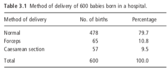
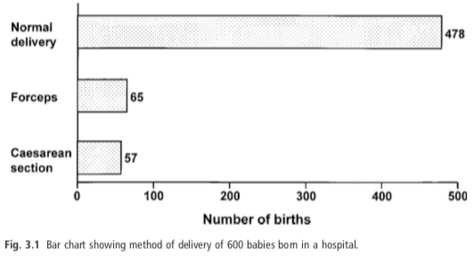
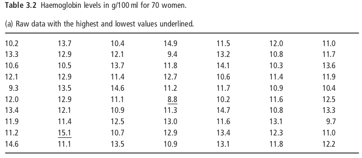
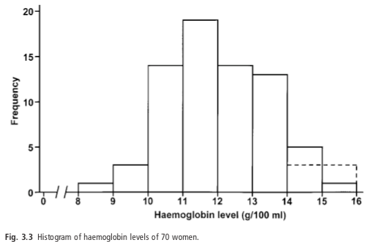
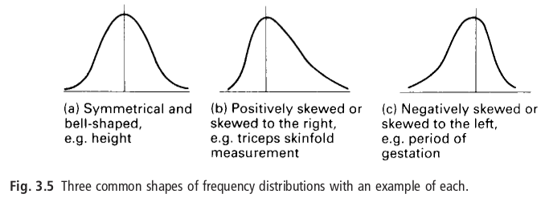
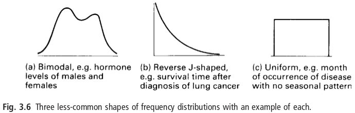

<style>
.forceBreak { -webkit-column-break-after: always; break-after: column; }
</style>

<style>
div.footnotes {
  position: absolute;
  bottom: 0;
  margin-bottom: 10px;
  width: 80%;
  font-size: 0.6em;
}
</style>

<script src="https://ajax.googleapis.com/ajax/libs/jquery/3.1.1/jquery.min.js"></script>
<script>
$(document).ready(function() {
  $('slide:not(.backdrop):not(.title-slide)').append('<div class=\"footnotes\">');

  $('footnote').each(function(index) {
    var text  = $(this).html();
    var fnNum = (index+1).toString();
    $(this).html("".sup());

    var footnote   = text + '<br/>';
    var oldContent = $(this).parents('slide').children('div.footnotes').html();
    var newContent = oldContent + footnote;
    $(this).parents('slide').children('div.footnotes').html(newContent);
  });
});
</script>


```{r include = FALSE}
knitr::opts_chunk$set(echo = FALSE)
## knitr::opts_knit$set(global.device = TRUE)
library(viridis)
library(ggplot2)
```

## This week {.flexbox .vcenter}

| Time                   | Session                   | Topic                                                                    |
| -----------------------|---------------------------|--------------------------------------------------------------------------|
| Mon 7 Oct 10:00-11:00  | Introduction and Lecture  | Population samples, summarizing data, and the normal distribution        |
| Mon 7 Oct 11:15-12:15  | Special Lecture           | Statistics in Epidemiology and Public Health (Prof Christl Donnelly CBE) | 
| Mon 7 Oct 14:00-15:30  | Applied Statistics Lab    | Reading a paper and analysis plan                                        |
| Weds 9 Oct 9:30-11:00  | R Statistical Computing   | R basics                                                                 |
| Weds 9 Oct 14:00-15:3  | Maths Refresher           | Calculus I: Derivatives                                                  |


## Learning Objectives

* Understand the purpose and principles of statistical inference.

* Define different types of data and identify examples where they naturally occur.

* Calculate and visualise meaningful quantitative summaries of different types of data.

* The normal distribution:
  * Understand why the normal distribution arises in many natural phenomena.
  * How we can use the normal distribution as _model_ to summarise data.

## Readings

Kirkwood and Sterne:

* Chapter 1: Basics -- Using this book
* Chapter 2: Defining the data
* Chapter 3: Displaying the data
* Chapter 4: Means, standard deviations, and standard errors
* Chapter 5: The normal distribution

Supplementary:

* Altman DG, Bland JM. Uncertainty and sampling error. 2014; 349: g7064.
* Altman DG, Bland JM. (1994) Quartiles, quintiles, centiles, and other quantiles. BMJ 309, 996.
* Altman DG, Bland JM. (1995) The normal distribution. BMJ, 310, 298.
* Altman DG, Bland JM. (2005) Standard deviations and standard errors. 331, 903.

## {.flexbox .vcenter .centered}

<font size="10">**Statistics: Population inference from a sample**</font>

## Sampling from a population {.build}


* Statistics is using data to _describe characteristics_, _estimate magnitude of associations_, and _test hypotheses_ in a __population__.

<div>
* Examples:
  - What is the average height of __men in the UK__?
  - Does Drug A improve survival more than Drug B for __patients with pancreatic cancer__?
  - Do __hospitals in the NHS__ meet the 4 hour A&E waiting time target?
  - Is this __flu season__ more severe than a typical flu season?
</div>

<div>
* Typically it is impossible, infeasible, or inefficient to collect data for an entire population.
   - If we could, no need to do statistics.
</div>

<div>
* Purpose of statistics: what can we conclude about a quantity or association of interest in a _population_ based on what we have observed amongst a given _sample_ from that population?
</div>

## Example: A&E waiting times {.build}

<div>
 * Example: The NHS A&E waiting time target---95% of patients should by admitted, transferred, or discharged within four hours.
   * Enshrined in the NHS Constitution: requires data each month on whether the health service is meeting this target.
</div>
<div>
 * Option 1: collect and report the wait time for every visitor to A&E in England.
   * Definitive yes/no as to whether target met---a _census_.
</div>
<div>
  * Option 2: visit 15 hospitals across England in the third week of each month; record the wait time for every 10th patient who attends A&E.
    * Determine national acheivement of the waiting time target based on what I observed in these 15 facilities---a _sample_.
</div>

## Example: A&E waiting times {.build}

<div>
  * Are the hospitals I sampled _representative_ of the target population (non-sampling error/bias)
    * _Simple random sampling_ from the entire target population is the best way to ensure this.
	* Not always feasible or economical...or obvious how to define a simple random sample.
	* Not much more about this in this course. _But think about it **every** time you report a statistical analysis._
</div>	
<div>
  * How confident can I be that the conclusions from the observed sample are reflective of the truth in the target population?
    * I would have observed, and _possibly_ concluded, something different if I had sampled 15 different hospitals.
	* Nonetheless, often I can be pretty confident---and I can know how confident I should be.
	* Answering this question is the majority of the rest of this course---and the majority of statistics.
</div>	
 
## {.flexbox .vcenter .centered} 

<font size="10">**Types of variables and describing a sample**</font>

## Types of data {.flexbox .vcenter .centered} 

| Type of data|            | Definition             | Examples                                            |
| ------------|------------|------------------------------------|-----------------------------------------------------------|
| Categorical | Binary     | Only 2 possible values                      | Gender (M/F), presence/absence of symptoms          |
|             | Nominal    | Many values, no ordering/ranking            | Place of birth, Blood group (A, B, AB, O)        |
|             | Ordinal    | Many values, no 'distance' between          | Stage of cancer (I, II, III, IV), Deprivation index |
| Numerical   | Discrete   | Discrete set of values, meaningful 'distance' | Number of children, Number of hospital beds         |
|             | Continuous | Takes take any value                        | Height, Diastolic blood pressure                    |

## Frequencies of categorical variables

Categorical variables are summarised by their frequency

* Count the number of observations in each category: **frequencies**.
* Divide by the total number of observations to obtain proportions: **relative frequencies**.
* Visualised by a bar chart.

<br>
<br>

<div class="centered">
  
</div>

<div class="centered">
  
</div>

## Frequency distributions of numerical variables

* Frequency distributions of numerical variables are usually illustrated as **histograms**.
* Also displayed as density plots---smoothed histograms.

<br>
<br>

<div class="centered">
  
</div>
<div class="centered">
  
</div>


## Frequency distributions of numerical variables {.build}

<div class="centered">
  
</div>
<br>
<div class="centered">
  
</div>


## Measures of central tendency {.build}

<div>
_Measures of central tendency_ describe the _central_ or _typical_ value of a probability distribution.
$$x = \{6, 9, 9, 1, 9, 6, 3, 8, 5\}$$
</div>

<div>
* **Mean**: the arithmetic average of a set of values.
$$\frac{6+9+9+1+9+6+3+8+5}{9} = \frac{56}{9} = 6.22$$
</div>

<div>
* **Median**: the middle value when a set of values are sequenced.
$$x = \{1, 3, 5, 6, \underline{\mathbf{6}}, 8, 9, 9, 9\}$$
</div>
<div>
* **Mode**: the value that occurs most.
$$x = \{6, \underline{\mathbf{9}}, \underline{\mathbf{9}}, 1, \underline{\mathbf{9}}, 6, 3, 8, 5\}$$
</div>

## Measures of central tendency

* Mode is the _only_ summary measure for binary or nominal data.
* Mean is the most common summary for numerical data.
* Median may be more appropriate if data are highly skewed.

<br>
<br>

In R:
```
> x <- c(6, 9, 9, 1, 9, 6, 3, 8, 5)

> mean(x)
[1] 6.222222

> median(x)
[1] 6

> sort(table(x), decreasing = TRUE)
9 6 1 3 5 8 
3 2 1 1 1 1 
```

## Measures of spread {.build}

_Measures of spread_ describe how similar or varied a set of values are.
$$x = \{6, 9, 9, 1, 9, 6, 3, 8, 5\}$$


## Measures of spread {.build}
<div>
* **Range**: the difference between the highest and lowest values.
$$\{\underline{\mathbf{1}}, 3, 5, 6, 6, 8, 9, 9, \underline{\mathbf{9}}\} \rightarrow 9-1 = 8$$
</div>

<div>
* **Interquartile range**: the difference between the 75% and 25% quintile of the distribution.
  * The range in which the middle 50% of the data falls.
$$\{1, 3, \underline{\mathbf{5}}, 6, 6, 8, \underline{\mathbf{9}}, 9, 9\} \rightarrow 9-5 = 4$$
</div>

<div>
* **Sample variance**: the average of the _squared_ deviations from the mean.

$$s^2 = \frac{\sum (x - \overline x)^2}{n-1} = \frac{1}{9-1}\sum{(\{6, 9, 9, 1, 9, 6, 3, 8, 5\} - 6.22)^2} = \frac{65.6}{8} = 8.2$$
</div>

<div>
* **Standard deviation**: square-root of the sample variance---measured in the same units as the observations.

$$s = \sqrt{s^2} = \sqrt{\frac{\sum (x - \overline x)^2}{n-1}} = \sqrt{8.2} = 2.9$$
</div>

## Measures of spread

* **Standard deviation** and variance are typically the preferred measure of spread.
  * Uses all of the observations, defined in terms of the deviations from the mean value $(x-\overline{x})$.
  * Usually about 70% of observations lie within one standard devation of their mean; 95% lie within 2 standard deviations.
* Range is very susceptible to outliers and random variation in the sample---not preferred.
* Interquartile range (IQR) can be a good alternative for skewed distributions, in conjunction with median.

```
> x <- c(6, 9, 9, 1, 9, 6, 3, 8, 5)

> max(x) - min(x)  # range
[1] 8
> quantile(x, c(0.25, 0.75))  # 25% and 75% quartiles
25% 75% 
  5   9 
> diff(quantile(x, c(0.25, 0.75)))  # Interquartile range
  4 
> var(x)  # variance
[1] 8.194444
> sd(x)   # standard deviation
[1] 2.862594
```

## {.flexbox .vcenter .centered}

<font size="10">**The normal distribution**</font>

## The normal distribution

```{r height_sample, include = FALSE}
## Sample of heights of `mheight_nsamp` adult men in the UK
set.seed(2446193)
mheight_nsamp <- 5000
mheight_mean <- 171.5  # 171.5cm
mheight_sd <- 6.5  # 6.5cm
mheight_sample <- rnorm(mheight_nsamp, mheight_mean, mheight_sd)
```

<div class="columns-2">

Example: Sample of heights of 5000 adult men in the UK.

```{r normal_density1, fig.height=4, fig.width=5, out.width="100%"}
par(mar = c(6.5, 3.5, 0.1, 0.1), mgp = c(2, 0.5, 0), tcl = -0.25, las = 1)
hist(mheight_sample, breaks = 100, freq = FALSE, col = "grey90", border = "grey40", bty = "o",
     main = NA, xlab = NA, ylab = NA, axes = FALSE)
mtext("Probability", 2, 2.5, las = 0)
mtext("Height (cm)", 1, 1.8, las = 0)
axis(1, c(100, max(mheight_sample)+1), labels = FALSE, lwd.ticks = 0)
axis(1, 15:19*10)
axis(2, c(-1, 0.06), labels = FALSE, lwd.ticks = 0)
axis(2, 0:7/100, label = FALSE)
axis(2, c(0, 2, 4, 6)/100, tick = FALSE)

segments(x0=mheight_mean, y0=0, y1 = 1.1 * dnorm(0) / mheight_sd,
         lty = 2, lwd = 3, col = "darkgreen")

arrows(x0=mheight_mean, y0=dnorm(1) / mheight_sd, x1 = mheight_mean + mheight_sd,
         lty = 2, lwd = 2, col = "darkgreen", length=0.1)

```

<p class="forceBreak"></p>

* Mean: 171.5cm
* Standard deviation: 6.5cm

<br>

<br>

</div>

## The normal distribution

<div class="columns-2">

Example: Sample of heights of 5000 adult men in the UK.

```{r normal_density2, fig.height=4, fig.width=5, out.width="100%"}
par(mar = c(6.5, 3.5, 0.1, 0.1), mgp = c(2, 0.5, 0), tcl = -0.25, las = 1)
hist(mheight_sample, breaks = 100, freq = FALSE, col = "grey90", border = "grey40", bty = "o",
     main = NA, xlab = NA, ylab = NA, axes = FALSE)
mtext("Probability", 2, 2.5, las = 0)
mtext("Height (cm)", 1, 1.8, las = 0)
axis(1, c(100, max(mheight_sample)+1), labels = FALSE, lwd.ticks = 0)
axis(1, 15:19*10)
axis(2, c(-1, 0.06), labels = FALSE, lwd.ticks = 0)
axis(2, 0:7/100, label = FALSE)
axis(2, c(0, 2, 4, 6)/100, tick = FALSE)

segments(x0=mheight_mean, y0=0, y1 = 1.1 * dnorm(0) / mheight_sd,
         lty = 2, lwd = 3, col = "darkgreen")

arrows(x0=mheight_mean, y0=dnorm(1) / mheight_sd, x1 = mheight_mean + mheight_sd,
         lty = 2, lwd = 2, col = "darkgreen", length=0.1)

x <- mheight_mean + seq(-3.1*mheight_sd, 3.1*mheight_sd, 0.1)
y <- dnorm(x, mheight_mean, mheight_sd)
lines(x, y, lwd=3, col = "red3")

axis(1, c(100, max(mheight_sample)+1), labels = FALSE, lwd.ticks = 0, line = 4.5)
axis(1, mheight_mean + -3:3 * mheight_sd,
     c(expression(mu-3*sigma),
       expression(mu-2*sigma),
       expression(mu-sigma),
       expression(mu),
       expression(mu+sigma),
       expression(mu+2*sigma),
       expression(mu+3*sigma)),
     line = 4.5)
```

<p class="forceBreak"></p>

* Mean: 171.5cm
* Standard deviation: 6.5cm

<br>

<div class="centered">

$$ y = \frac{1}{\sqrt{2\pi\sigma^2}} \exp\left(\frac{-(x - \mu)^2}{2\sigma^2}\right) $$ 

$\mu$: mean of the distribution

$\sigma$: standard deviation of the distribution
</div>

<br>

</div>

## The normal distribution

<div class="columns-2">

Example: Sample of heights of 5000 adult men in the UK.

```{r normal_density3, fig.height=4, fig.width=5, out.width="100%"}
par(mar = c(6.5, 3.5, 0.1, 0.1), mgp = c(2, 0.5, 0), tcl = -0.25, las = 1)
hist(mheight_sample, breaks = 100, freq = FALSE, col = "grey90", border = "grey40", bty = "o",
     main = NA, xlab = NA, ylab = NA, axes = FALSE)
mtext("Probability", 2, 2.5, las = 0)
mtext("Height (cm)", 1, 1.8, las = 0)
axis(1, c(100, max(mheight_sample)+1), labels = FALSE, lwd.ticks = 0)
axis(1, 15:19*10)
axis(2, c(-1, 0.06), labels = FALSE, lwd.ticks = 0)
axis(2, 0:7/100, label = FALSE)
axis(2, c(0, 2, 4, 6)/100, tick = FALSE)

segments(x0=mheight_mean, y0=0, y1 = 1.1 * dnorm(0) / mheight_sd,
         lty = 2, lwd = 3, col = "darkgreen")

arrows(x0=mheight_mean, y0=dnorm(1) / mheight_sd, x1 = mheight_mean + mheight_sd,
         lty = 2, lwd = 2, col = "darkgreen", length=0.1)

x <- mheight_mean + seq(-3.1*mheight_sd, 3.1*mheight_sd, 0.1)
y <- dnorm(x, mheight_mean, mheight_sd)
lines(x, y, lwd=3, col = "red3")

axis(1, c(100, max(mheight_sample)+1), labels = FALSE, lwd.ticks = 0, line = 4.5)
axis(1, mheight_mean + -3:3 * mheight_sd,
     c(expression(mu-3*sigma),
       expression(mu-2*sigma),
       expression(mu-sigma),
       expression(mu),
       expression(mu+sigma),
       expression(mu+2*sigma),
       expression(mu+3*sigma)),
     line = 4.5)
```

<p class="forceBreak"></p>

* Mean: 171.5cm
* Standard deviation: 6.5cm

<br>

<div class="centered">

$$ y = \frac{1}{\sqrt{2\pi\sigma^2}} \exp\left(\frac{-(x - \mu)^2}{2\sigma^2}\right) $$ 

$\mu$: mean of the distribution

$\sigma$: standard deviation of the distribution
</div>

<br>

* Also called the _Gaussian_ distribution.
* Symmetric &rightarrow; $\mu$ also median and mode.
* Sometimes described my mean and SD $(\mu, \sigma)$, sometimes by mean 
  and variance $(\mu, \sigma^2)$.
  * R uses `dnorm(x= , mean= , sd= )`.

</div>

## Why the normal distribution?

## 

<div class="centered">
  
</div>


## {.centered}

<br>
<br>

<br>
<br>
<br>

<font size="5">_"Research by Deliveroo found that **a third of the country's workforce** eats the same thing every day, and **it's the ham sandwich**, the simple pleasure that it is, which is most popular."_</font><footnote>https://www.mirror.co.uk/news/uk-news/third-brits-same-lunch-every-11116068 </footnote>

## Can we replicate Deliveroo's study? {.build}

<div>
* Suppose it's true that it's true that 1/3 of Brits eat a ham sandwich every day for lunch.<sup>1</sup><footnote> <sup>1</sup> Not what the Deliveroo study actually found...but the Mirror's writing is confusing, so go with me. </footnote>
</div>
<div>
* Go out on Praed St, ask a random person _"Did you have a ham sandwich for lunch yesterday?"_
</div>
<div>
  * They answer "Yes" or "No"---in this case "Yes".
<br>
<br>
```{r, fig.height=3.5, fig.width=3.3, out.width="30%"}
set.seed(6077347)
nask <- 1

th <- list(xlab("Respondents who had\nham sandwich yesterday"),
           ylab("Number of survey days"),
           theme(plot.title = element_text(face=2, size = 12),
                 axis.text = element_text(size = 11),
                 panel.grid = element_blank()))


df <- data.frame(nsandwich = c(0, 1), ndays = c(0, 1))

ggplot(df, aes(nsandwich, ndays)) +
  geom_col() +
  theme_light() +
  scale_x_continuous(breaks = 0:1) +
  scale_y_continuous(breaks = 0:1, limits = c(0, 1.5)) +
  th +
  ggtitle("Asked 1 person per day; 1 day")

```
</div>


## Can we replicate Deliveroo's study?


* Suppose it's true that it's true that 1/3 of Brits eat a ham sandwich every day for lunch.<sup>1</sup><footnote> <sup>1</sup> Not what the Deliveroo study actually found...but the Mirror's writing is confusing, so go with me. </footnote>

* Go out on Praed St, ask a random person _"Did you have a ham sandwich for lunch yesterday?"_
* They answer "Yes" or "No"---in this case "Yes".
* Do this for 5 days in a row...

```{r, fig.height=3.5, fig.width=3.3, out.width="30%"}
set.seed(6077347)
nask <- 1

df <- data.frame(nsandwich = c(0, 1), ndays = c(0, 1))
ggplot(df, aes(nsandwich, ndays)) +
  geom_col() +
  theme_light() +
  scale_x_continuous(breaks = 0:1) +
  scale_y_continuous(breaks = 0:1, limits = c(0, 1.5)) +
  th +
  ggtitle("Asked 1 person per day; 1 day")


df <- data.frame(nsandwich = c(0, 1), ndays = c(3, 2))
ggplot(df, aes(nsandwich, ndays)) +
  geom_col() +
  theme_light() +
  scale_x_continuous(breaks = 0:1) +
  th +
  ggtitle(paste("Asked 1 person per day;", sum(df$ndays), " days"))

ndays <- 50
df <- type.convert(as.data.frame(table(nsandwich = rbinom(ndays, nask, 1/3)), responseName = "ndays") )
```

## Can we replicate Deliveroo's study?

* Suppose it's true that it's true that 1/3 of Brits eat a ham sandwich every day for lunch.<sup>1</sup><footnote> <sup>1</sup> Not what the Deliveroo study actually found...but the Mirror's writing is confusing, so go with me. </footnote>

* Go out on Praed St, ask a random person _"Did you have a ham sandwich for lunch yesterday?"_
 * They answer "Yes" or "No"---in this case "Yes".
* Do this for 5 days in a row...50 days in a row...

```{r, fig.height=3.5, fig.width=3.3, out.width="30%"}
set.seed(6077347)
nask <- 1

df <- data.frame(nsandwich = c(0, 1), ndays = c(0, 1))
ggplot(df, aes(nsandwich, ndays)) +
  geom_col() +
  theme_light() +
  scale_x_continuous(breaks = 0:1) +
  scale_y_continuous(breaks = 0:1, limits = c(0, 1.5)) +
  th +
  ggtitle("Asked 1 person per day; 1 day")


df <- data.frame(nsandwich = c(0, 1), ndays = c(3, 2))
ggplot(df, aes(nsandwich, ndays)) +
  geom_col() +
  theme_light() +
  scale_x_continuous(breaks = 0:1) +
  th +
  ggtitle(paste("Asked 1 person per day;", sum(df$ndays), " days"))

ndays <- 50
df <- type.convert(as.data.frame(table(nsandwich = rbinom(ndays, nask, 1/3)), responseName = "ndays") )

ggplot(df, aes(nsandwich, ndays)) +
  geom_col() +
  theme_light() +
  scale_x_continuous(breaks = 0:1) +
  th +
  ggtitle(paste("Asked 1 person per day;", sum(df$ndays), " days"))
```

## Can we replicate Deliveroo's study? {.build}

```{r, fig.height=2.8, fig.width=3.3, out.width="30%"}
set.seed(6077347)
nask <- 5

fn <- function(nask, ndays) {
  df <- type.convert(as.data.frame(table(nsandwich = rbinom(ndays, nask, 1/3)), responseName = "ndays") )
  ggplot(df, aes(nsandwich, ndays)) +
    geom_col() +
    theme_light() +
    scale_x_continuous(limits = c(0-0.5, nask+0.1)) +
    xlab("Respondents ham sandwich yesterday") +
    ylab("Number of survey days") + 
    ggtitle(paste("Asked", nask, "people per day;", sum(df$ndays), "days")) +
    theme(plot.title = element_text(face=2, size = 12),
          axis.text = element_text(size = 11),
          panel.grid = element_blank())
}

fn(nask, 1)
fn(nask, 5)
fn(nask, 50)

```

```{r, fig.height=2.8, fig.width=3.3, out.width="30%"}
nask <- 15
fn(nask, 1)
fn(nask, 5)
fn(nask, 50)
```

## Can we replicate Deliveroo's study? {.flexbox .vcenter}

Increasing number of people per day; 50 days in a row

```{r, fig.height=3, fig.width=3.3, out.width="30%"}
set.seed(6077347)
fn(30, 50)
fn(50, 50)
fn(150, 50)

```


## The Central Limit Theorom {.build}

* If $\{x_1, x_2, \ldots, x_n\}$ are _indepedent_ random variables, then their sum $\Sigma_{i=1}^n x_i$ tends to a normal distribution as $n\to \infty$.
  * Even if distribution of each observation $x_i$ is not normal.
  * E.g. "had a sandwich for lunch today" takes values 0/1 -- not normal distribution!

<div>
* **Important application: distribution of the sample mean**
  * If $\{x_1, x_2, \ldots, x_n\}$ are observations on a random sample from a population,
    * The __sample mean__ is a sum of random variables: 
      $$\overline x = \frac{1}{n} \sum_{i=1}^n x_i = \frac{1}{n}(x_1+x_2+\ldots+x_n).$$
</div>
<div>
  * The distribution of the sample mean $\overline x$ is approximately normal, with mean $\overline x$ and _standard error_: $$\sigma_{\overline x} = \frac{1}{\sqrt{n}}\cdot\mathrm{sd}(x_i) \approx \frac{1}{\sqrt{n}} \cdot s = 
  \frac{1}{\sqrt{n}} \cdot \sqrt{\frac{\sum (x_i - \overline x)^2}{n-1}}.$$
</div>
  

## {.flexbox .vcenter}

<font size="6">Questions?</font>
