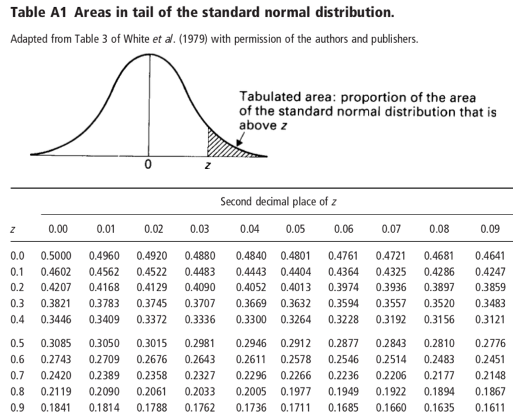
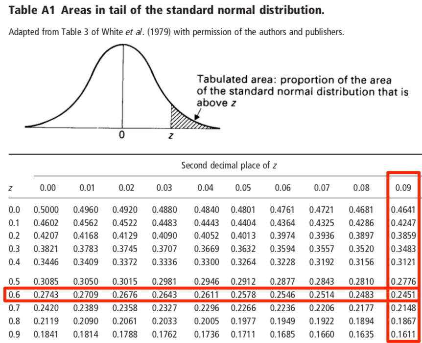
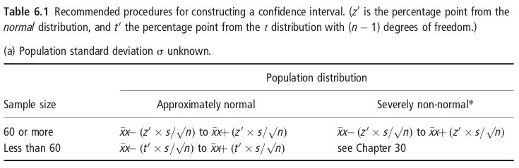

<style>
.forceBreak { -webkit-column-break-after: always; break-after: column; }
</style>

<style>
div.footnotes {
  position: absolute;
  bottom: 0;
  margin-bottom: 10px;
  width: 80%;
  font-size: 0.6em;
}
</style>

<script src="https://ajax.googleapis.com/ajax/libs/jquery/3.1.1/jquery.min.js"></script>
<script>
$(document).ready(function() {
  $('slide:not(.backdrop):not(.title-slide)').append('<div class=\"footnotes\">');

  $('footnote').each(function(index) {
    var text  = $(this).html();
    var fnNum = (index+1).toString();
    $(this).html("".sup());

    var footnote   = text + '<br/>';
    var oldContent = $(this).parents('slide').children('div.footnotes').html();
    var newContent = oldContent + footnote;
    $(this).parents('slide').children('div.footnotes').html(newContent);
  });
});
</script>


```{r include = FALSE}
knitr::opts_chunk$set(echo = FALSE, warning = FALSE, message = FALSE, cache = TRUE)
## knitr::opts_knit$set(global.device = TRUE)
library(viridis)
library(tidyverse)
library(kableExtra)
options("kableExtra.html.bsTable" = TRUE)

```

## This week {.flexbox .vcenter}

| Time                   | Session                   | Topic                                                                    |
| -----------------------|---------------------------|--------------------------------------------------------------------------|
| Mon 7 Oct 10:00-11:00  | Tutorial                  | Tutorial sheet 1 review: Summarising data in R                           |
| Mon 7 Oct 11:15-12:15  | Lecture                   | Confidence Intervals, Hypothesis Testing                                 | 
| Mon 7 Oct 14:00-15:30  | Applied Statistics Lab    | Project 1: Epidemiology and determinants of high blood pressure          |
| Weds 9 Oct 9:30-11:00  | R Statistical Computing   | Manipulating R objects                                                   |
| Weds 9 Oct 14:00-15:30  | Maths Refresher           | Calculus II: Integrals                                                   |


## Learning Objectives

* Use the normal distribution to estimate population distributions.
* Define and interpret confidence intervals.
* Calculate confidence intervals for a sample mean.
* Understand why the t-distribution arises and how to use it to calculate confidence intervals for small sample sizes.
* Describe the principles of hypothesis testing and specify a 'null' hypothesis.


## Readings

Kirkwood and Sterne:

* Chapter 5: The normal distribution
* Chapter 6: Confidence interval for a mean
* Chapter 7: Comparison of two means: confidence intervals, hypothesis tests and _P_-values
* Chapter 8: Using _P_-values and confidence intervals to interpret the results of statistical analyses

Supplementary:

* Altman DG, Bland JM. (2005) Standard deviations and standard errors. BMJ 331, 903.
* Bland JM, Altman DG. (1994) One- and two-sided tests of significance. BMJ 309, 248.

## {.flexbox .vcenter .centered}

<font size="10">**Using the normal distribution**</font>

## The normal distribution

```{r height_sample, include = FALSE}
## Sample of heights of `mheight_nsamp` adult men in the UK
set.seed(2446193)
mheight_nsamp <- 5000
mheight_mean <- 171.5  # 171.5cm
mheight_sd <- 6.5  # 6.5cm
mheight_sample <- rnorm(mheight_nsamp, mheight_mean, mheight_sd)
```

Example: Sample of heights of 5000 adult men in the UK.

* Mean: 171.5cm
* Standard deviation: 6.5cm

<div class="columns-2">
```{r normal_density1, fig.height=4.0, fig.width=5, out.width="100%"}

p1 <- ggplot(data.frame(height = mheight_sample), aes(height)) +
  theme_bw() +
  theme(panel.grid = element_blank()) +
  geom_histogram(aes(y = ..density..), color = "grey50", alpha = 0.3) +
  geom_segment(x = mheight_mean, xend = mheight_mean,
               y = 0, yend = 1.1 * dnorm(0) / mheight_sd,
               size = 1.0, color = "darkgreen", linetype = "dashed") +
  geom_segment(x = mheight_mean,
               xend = mheight_mean + mheight_sd,
               y = dnorm(1) / mheight_sd,
               yend = dnorm(1) / mheight_sd,
               size = 1.0, color = "darkgreen", linetype = "dashed",
               arrow = arrow(length = unit(0.1, "inches"), type = "closed")) +
  xlab("Height (cm)") +
  ylab("Probability density") +
  coord_cartesian(ylim = c(0, 1.15 * dnorm(0) / mheight_sd),
                  xlim = mheight_mean + c(-1,1) * 3.4 * mheight_sd,
                  clip = "off") +
  theme(plot.margin = margin(0.1, 0.1, 2.5, 0.1, "lines"))
p1
```
</div>

## The normal distribution

Example: Sample of heights of 5000 adult men in the UK.

* Mean: 171.5cm
* Standard deviation: 6.5cm

<div class="columns-2">
```{r, fig.height=4.0, fig.width=5, out.width="100%"}

xaxis_snd <- list(
  annotate("segment",
           x = mheight_mean - mheight_sd * 3.5,
           xend = mheight_mean + mheight_sd * 3.5,
           y = -0.016,
           yend = -0.016),
  annotate("segment",
           x = mheight_mean + -3:3 * mheight_sd,
           xend = mheight_mean + -3:3 * mheight_sd,
           y = -0.016,
           yend = -0.017),
  annotate("text",
           x = mheight_mean + -3:3*mheight_sd,
           y = -0.02, 
           label = c("mu-3*sigma", "mu-2*sigma", "mu-sigma", "mu",
                     "mu+sigma", "mu+2*sigma", "mu+3*sigma"),
           parse = TRUE, size = 3.5)
)

p2 <- p1 + stat_function(fun = dnorm,
                         args = list(mean = mheight_mean, sd = mheight_sd),
                         color = "red3", size = 1.2) +
  xaxis_snd

p2
```

<div class="vcenter">
<br>
<br>

$$ y = \frac{1}{\sqrt{2\pi\sigma^2}} \exp\left(\frac{-(x - \mu)^2}{2\sigma^2}\right) $$ 
</div>
</div>


```{r}

xlim <- mheight_mean + c(-1, 1) * 3.3 * mheight_sd

p3dens <- ggplot(data.frame(height = xlim), aes(height)) +
  theme_bw() +
  theme(panel.grid = element_blank()) +
  xlab("Height (cm)") +
  ylab("Probability density") +
  coord_cartesian(ylim = c(0, 1.15 * dnorm(0) / mheight_sd),
                  xlim = xlim,
                  clip = "off") +
  theme(plot.margin = margin(0.1, 0.5, 2.5, 0.5, "lines")) +
  stat_function(fun = dnorm,
                args = list(mean = mheight_mean, sd = mheight_sd),
                color = "red3", size = 1.2) +
    annotate("segment",
           x = mheight_mean - mheight_sd * 3.5,
           xend = mheight_mean + mheight_sd * 3.5,
           y = -0.016 * 1.4,
           yend = -0.016 * 1.4) +
  annotate("segment",
           x = mheight_mean + -3:3 * mheight_sd,
           xend = mheight_mean + -3:3 * mheight_sd,
           y = -0.016 * 1.4,
           yend = -0.017 * 1.4) +
  annotate("text",
           x = mheight_mean + -3:3*mheight_sd,
           y = -0.02 * 1.4, 
           label = c("mu-3*sigma", "mu-2*sigma", "mu-sigma", "mu",
                     "mu+sigma", "mu+2*sigma", "mu+3*sigma"),
           parse = TRUE, size = 3.5)


p3dist <- ggplot(data.frame(height = xlim), aes(height)) +
  theme_bw() +
  theme(panel.grid = element_blank()) +
  xlab("Height (cm)") +
  ylab("Cumulative probability") +
  coord_cartesian(ylim = c(0, 1),
                  xlim = xlim,
                  clip = "off") +
  theme(plot.margin = margin(0.1, 0.5, 2.5, 0.5, "lines")) +
  stat_function(fun = pnorm,
                args = list(mean = mheight_mean, sd = mheight_sd),
                color = "red3", size = 1.2) +
  annotate("segment",
           x = mheight_mean - mheight_sd * 3.5,
           xend = mheight_mean + mheight_sd * 3.5,
           y = -0.20 *1.5,
           yend = -0.2*1.5) +
  annotate("segment",
           x = mheight_mean + -3:3 * mheight_sd,
           xend = mheight_mean + -3:3 * mheight_sd,
           y = -0.2*1.5,
           yend = -0.22 *1.5) +
  annotate("text",
           x = mheight_mean + -3:3*mheight_sd,
           y = -0.3 * 1.5, 
           label = c("mu-3*sigma", "mu-2*sigma", "mu-sigma", "mu",
                     "mu+sigma", "mu+2*sigma", "mu+3*sigma"),
           parse = TRUE, size = 3.5)
```

## Area under the normal distribution

Distribution of height of men in the UK: $\mu \approx 171.5$cm; $\sigma \approx 6.5$cm

<br>
<div class="centered">
```{r, fig.height=3.0, fig.width=3.75, out.width="45%"}

p3dens +
  stat_function(fun = dnorm,
                xlim = xlim,
                args = list(mean = mheight_mean, sd = mheight_sd),
                geom = "area",
                fill = "red3", alpha = 0.5)

p3dist +
  annotate("point", x = 150, y = 0, color = "darkred", size = 3.5) +
  annotate("point", x = 193, y = 1, color = "darkred", size = 3.5) +
  annotate("segment",
           x = 150, xend = 150,
           y = 0 + 0.03, yend = 1 - 0.03,
           arrow = arrow(length = unit(0.1, "inches"), angle = 20,
                         type = "closed", ends = "both"),
           linetype = "dashed", color = "darkred")
```  
</div>


## Area under the normal distribution

* What percentage of adult men in the UK are below 180cm tall?

<br>
<div class="centered">
```{r, fig.height=3.0, fig.width=3.75, out.width="45%"}

x1 <- 150;
x2 <- 180
y1 <- pnorm(x1, mheight_mean, mheight_sd)
y2 <- pnorm(x2, mheight_mean, mheight_sd)

p3dens +
  stat_function(fun = dnorm,
                xlim = c(x1, x2),
                args = list(mean = mheight_mean, sd = mheight_sd),
                geom = "area",
                fill = "red3", alpha = 0.5)

p3dist 
```
</div>

## Area under the normal distribution

* What percentage of adult men in the UK are below 180cm tall?

<br>
<div class="centered">
```{r, fig.height=3.0, fig.width=3.75, out.width="45%"}

x1 <- 150;
x2 <- 180
y1 <- pnorm(x1, mheight_mean, mheight_sd)
y2 <- pnorm(x2, mheight_mean, mheight_sd)

p3dens +
  stat_function(fun = dnorm,
                xlim = c(x1, x2),
                args = list(mean = mheight_mean, sd = mheight_sd),
                geom = "area",
                fill = "red3", alpha = 0.5)

p3dist +
  annotate("point", x = x2, y = y2, color = "darkred", size = 3.5) +
  annotate("segment", x = x2, xend = x2, y = 0, yend = y2 -0.03,
           arrow = arrow(length = unit(0.1, "inches"), angle = 20, type = "closed"),
           linetype = "dashed", color = "darkred")
```
</div>

## Area under the normal distribution

* What percentage of adult men in the UK are below 180cm tall?

<br>
<div class="centered">
```{r, fig.height=3.0, fig.width=3.75, out.width="45%"}

x1 <- 150;
x2 <- 180
y1 <- pnorm(x1, mheight_mean, mheight_sd)
y2 <- pnorm(x2, mheight_mean, mheight_sd)

p3dens +
  stat_function(fun = dnorm,
                xlim = c(x1, x2),
                args = list(mean = mheight_mean, sd = mheight_sd),
                geom = "area",
                fill = "red3", alpha = 0.5)

p3dist +
  annotate("point", x = x2, y = y2, color = "darkred", size = 3.5) +
  annotate("segment", x = x2, xend = x2, y = 0, yend = y2 -0.03,
           arrow = arrow(length = unit(0.1, "inches"), angle = 20, type = "closed"),
           linetype = "dashed", color = "darkred") +
  annotate("segment", x = x2, xend = 148, y = y2, yend = y2,
           arrow = arrow(length = unit(0.1, "inches"), angle = 20, type = "closed"),
           linetype = "dashed", color = "darkred")
```
</div>


## Area under the normal distribution

* What percentage of adult men in the UK are **less** than 180cm tall?

<br>
<div class="centered">
```{r, fig.height=3.0, fig.width=3.75, out.width="45%"}

x1 <- 150;
x2 <- 180
y1 <- pnorm(x1, mheight_mean, mheight_sd)
y2 <- pnorm(x2, mheight_mean, mheight_sd)

p3dens +
  stat_function(fun = dnorm,
                xlim = c(x1, x2),
                args = list(mean = mheight_mean, sd = mheight_sd),
                geom = "area",
                fill = "red3", alpha = 0.5)

p3dist +
  annotate("point", x = x2, y = y2, color = "darkred", size = 3.5) +
  annotate("segment", x = x2, xend = x2, y = 0, yend = y2 -0.03,
           arrow = arrow(length = unit(0.1, "inches"), angle = 20, type = "closed"),
           linetype = "dashed", color = "darkred") +
  annotate("segment", x = x2, xend = 148, y = y2, yend = y2,
           arrow = arrow(length = unit(0.1, "inches"), angle = 20, type = "closed"),
           linetype = "dashed", color = "darkred")
```
</div>

* `pnorm(q = 180, mean = 171.5, sd = 6.5) = ` `r pnorm(180, 171.5, 6.5)`


## Area under the normal distribution

* What percentage of adult men in the UK are **greater** than 169cm tall?

<br>
<div class="centered">
```{r, fig.height=3.0, fig.width=3.75, out.width="45%"}

x1 <- 169;
x2 <- 193
y1 <- pnorm(x1, mheight_mean, mheight_sd)
y2 <- pnorm(x2, mheight_mean, mheight_sd)

p3dens +
  stat_function(fun = dnorm,
                xlim = c(x1, x2),
                args = list(mean = mheight_mean, sd = mheight_sd),
                geom = "area",
                fill = "red3", alpha = 0.5)

p3dist +
  annotate("point", x = x1, y = y1, color = "darkred", size = 3.5) +
  annotate("segment", x = x1, xend = x1, y = 0, yend = y1 -0.03,
           arrow = arrow(length = unit(0.1, "inches"), angle = 20, type = "closed"),
           linetype = "dashed", color = "darkred") +
  annotate("segment", x = x1, xend = 148, y = y1, yend = y1,
           arrow = arrow(length = unit(0.1, "inches"), angle = 20, type = "closed"),
           linetype = "dashed", color = "darkred") +
  annotate("segment",
           x = 148.5, xend = 148.5,
           y = y1 + 0.03, yend = 1.0,
           arrow = arrow(length = unit(0.1, "inches"), angle = 20,
                         type = "closed", ends = "both"),
           linetype = "dashed", color = "darkred")
```
</div>

* `1 - pnorm(q = 169, mean = 171.5, sd = 6.5) = ` `r 1 - pnorm(169, 171.5, 6.5)`
* `pnorm(q = 169, mean = 171.5, sd = 6.5, lower.tail = FALSE) = ` `r pnorm(169, 171.5, 6.5, lower.tail = FALSE)`


## Area under the normal distribution

* What percentage of adult men in the UK are **between** 165cm and 175cm?

<br>
<div class="centered">
```{r, fig.height=3.0, fig.width=3.75, out.width="45%"}

x1 <- 165;
x2 <- 175
y1 <- pnorm(x1, mheight_mean, mheight_sd)
y2 <- pnorm(x2, mheight_mean, mheight_sd)

p3dens +
  stat_function(fun = dnorm,
                xlim = c(x1, x2),
                args = list(mean = mheight_mean, sd = mheight_sd),
                geom = "area",
                fill = "red3", alpha = 0.5)

p3dist +
  annotate("point", x = x1, y = y1, color = "darkred", size = 3.5) +
  annotate("point", x = x2, y = y2, color = "darkred", size = 3.5) +
  annotate("segment", x = x1, xend = x1, y = 0, yend = y1 -0.03,
           arrow = arrow(length = unit(0.1, "inches"), angle = 20, type = "closed"),
           linetype = "dashed", color = "darkred") +
  annotate("segment", x = x1, xend = 148, y = y1, yend = y1,
           arrow = arrow(length = unit(0.1, "inches"), angle = 20, type = "closed"),
           linetype = "dashed", color = "darkred") +
  annotate("segment", x = x2, xend = x2, y = 0, yend = y2 -0.03,
           arrow = arrow(length = unit(0.1, "inches"), angle = 20, type = "closed"),
           linetype = "dashed", color = "darkred") +
  annotate("segment", x = x2, xend = 148, y = y2, yend = y2,
           arrow = arrow(length = unit(0.1, "inches"), angle = 20, type = "closed"),
           linetype = "dashed", color = "darkred") +
  annotate("segment",
           x = 148.5, xend = 148.5,
           y = y1 + 0.03, yend = y2 - 0.03,
           arrow = arrow(length = unit(0.1, "inches"), angle = 20,
                         type = "closed", ends = "both"),
           linetype = "dashed", color = "darkred")
```
</div>

* `pnorm(q = 175, 171.5, 6.5)  - pnorm(q = 165, 171.5, 6.5) = ` `r pnorm(q = 175, 171.5, 6.5)  - pnorm(q = 165, 171.5, 6.5)`


## Area under the normal distribution  {.build}

<div>
* What is the interquartile range of adult male height?
  * _Go the other direction._
</div>

<div>
<div class="centered">
```{r, fig.height=3.0, fig.width=3.75, out.width="45%"}

y1 <- 0.25 
y2 <- 0.75 
x1 <- qnorm(0.25, mheight_mean, mheight_sd)
x2 <- qnorm(0.75, mheight_mean, mheight_sd)

p3dens +
  annotate("point", x = x2, y = 0, color = "darkred", size = 3.5)

p3dist +
  annotate("point", x = x2, y = y2, color = "darkred", size = 3.5) +
  annotate("segment", x = x2, xend = x2, y = 0, yend = y2 -0.03,
           arrow = arrow(length = unit(0.1, "inches"), angle = 20, type = "closed", ends = "first"),
           linetype = "dashed", color = "darkred") +
  annotate("segment", x = x2, xend = 148, y = y2, yend = y2,
           arrow = arrow(length = unit(0.1, "inches"), angle = 20, type = "closed", ends = "first"),
           linetype = "dashed", color = "darkred")
```
</div>

* `qnorm(p = 0.75, mean = 171.5, sd = 6.5) = ` `r sprintf("%.1f", qnorm(p = 0.75, mean = 171.5, sd = 6.5))`
</div>

## Area under the normal distribution

* What is the interquartile range of adult male height?
  * _Go the other direction._

<div class="centered">
```{r, fig.height=3.0, fig.width=3.75, out.width="45%"}

y1 <- 0.25 
y2 <- 0.75 
x1 <- qnorm(0.25, mheight_mean, mheight_sd)
x2 <- qnorm(0.75, mheight_mean, mheight_sd)

p3dens +
  annotate("point", x = x2, y = 0, color = "darkred", size = 3.5) +
  annotate("point", x = x1, y = 0, color = "darkred", size = 3.5)

p3dist +
  annotate("point", x = x1, y = y1, color = "darkred", size = 3.5) +
  annotate("point", x = x2, y = y2, color = "darkred", size = 3.5) +
  annotate("segment", x = x1, xend = x1, y = 0, yend = y1 -0.03,
           arrow = arrow(length = unit(0.1, "inches"), angle = 20, type = "closed", ends = "first"),
           linetype = "dashed", color = "darkred") +
  annotate("segment", x = x1, xend = 148, y = y1, yend = y1,
           arrow = arrow(length = unit(0.1, "inches"), angle = 20, type = "closed", ends = "first"),
           linetype = "dashed", color = "darkred") +
  annotate("segment", x = x2, xend = x2, y = 0, yend = y2 -0.03,
           arrow = arrow(length = unit(0.1, "inches"), angle = 20, type = "closed", ends = "first"),
           linetype = "dashed", color = "darkred") +
  annotate("segment", x = x2, xend = 148, y = y2, yend = y2,
           arrow = arrow(length = unit(0.1, "inches"), angle = 20, type = "closed", ends = "first"),
           linetype = "dashed", color = "darkred")

```
</div>

* `qnorm(p = 0.75, mean = 171.5, sd = 6.5) = ` `r sprintf("%.1f", qnorm(p = 0.75, mean = 171.5, sd = 6.5))`
* `qnorm(p = 0.25, mean = 171.5, sd = 6.5) = ` `r sprintf("%.1f", qnorm(p = 0.25, mean = 171.5, sd = 6.5))`


## Area under the normal distribution

<div>
* What is the interquartile range of adult male height?
  * _Go the other direction._
</div>

<div>
<div class="centered">
```{r, fig.height=3.0, fig.width=3.75, out.width="45%"}

y1 <- 0.25 
y2 <- 0.75 
x1 <- qnorm(0.25, mheight_mean, mheight_sd)
x2 <- qnorm(0.75, mheight_mean, mheight_sd)

p3dens +
  stat_function(fun = dnorm,
                xlim = c(x1, x2),
                args = list(mean = mheight_mean, sd = mheight_sd),
                geom = "area",
                fill = "red3", alpha = 0.5) +
  annotate("point", x = x2, y = 0, color = "darkred", size = 3.5) +
  annotate("point", x = x1, y = 0, color = "darkred", size = 3.5) +
  annotate("segment", x = x1+1, xend = x2-1, y = 0.0005, yend = 0.0005,
           color = "darkred", linetype = "dashed",
           arrow = arrow(length = unit(0.1, "inches"), angle = 20,
                         type = "closed", ends = "both"))


p3dist +
  annotate("point", x = x1, y = y1, color = "darkred", size = 3.5) +
  annotate("point", x = x2, y = y2, color = "darkred", size = 3.5) +
  annotate("segment", x = x1, xend = x1, y = 0, yend = y1 -0.03,
           arrow = arrow(length = unit(0.1, "inches"), angle = 20, type = "closed", ends = "first"),
           linetype = "dashed", color = "darkred") +
  annotate("segment", x = x1, xend = 148, y = y1, yend = y1,
           arrow = arrow(length = unit(0.1, "inches"), angle = 20, type = "closed", ends = "first"),
           linetype = "dashed", color = "darkred") +
  annotate("segment", x = x2, xend = x2, y = 0, yend = y2 -0.03,
           arrow = arrow(length = unit(0.1, "inches"), angle = 20, type = "closed", ends = "first"),
           linetype = "dashed", color = "darkred") +
  annotate("segment", x = x2, xend = 148, y = y2, yend = y2,
           arrow = arrow(length = unit(0.1, "inches"), angle = 20, type = "closed", ends = "first"),
           linetype = "dashed", color = "darkred") +
  annotate("segment", x = x1+1, xend = x2-1, y = 0.0005, yend = 0.0005,
           color = "darkred", linetype = "dashed",
           arrow = arrow(length = unit(0.1, "inches"), angle = 20,
                         type = "closed", ends = "both"))
```
</div>

* `qnorm(p = 0.75, mean = 171.5, sd = 6.5) = ` `r sprintf("%.1f", qnorm(p = 0.75, mean = 171.5, sd = 6.5))`
* `qnorm(p = 0.25, mean = 171.5, sd = 6.5) = ` `r sprintf("%.1f", qnorm(p = 0.25, mean = 171.5, sd = 6.5))`
</div>

## Area under the normal distribution {.build}

<div>
* What is the most extreme 5% of shortest and tallest men in the UK?
  * _Use the 2.5\% and 97.5% percentile of the distribution._
</div>

<div>
<div class="centered">
```{r, fig.height=3.0, fig.width=3.75, out.width="45%"}

y1 <- 0.025 
y2 <- 0.975 
x1 <- qnorm(y1, mheight_mean, mheight_sd)
x2 <- qnorm(y2, mheight_mean, mheight_sd)

p3dens +
  stat_function(fun = dnorm,
                xlim = c(xlim[1], x1),
                args = list(mean = mheight_mean, sd = mheight_sd),
                geom = "area",
                fill = "red3", alpha = 0.5) +
  stat_function(fun = dnorm,
                xlim = c(x2, xlim[2]),
                args = list(mean = mheight_mean, sd = mheight_sd),
                geom = "area",
                fill = "red3", alpha = 0.5) +
  annotate("point", x = x2, y = 0, color = "darkred", size = 3.5) +
  annotate("point", x = x1, y = 0, color = "darkred", size = 3.5)

p3dist +
  annotate("point", x = x1, y = y1, color = "darkred", size = 3.5) +
  annotate("point", x = x2, y = y2, color = "darkred", size = 3.5) +
  annotate("segment", x = x1, xend = x1, y = 0, yend = y1 -0.03,
           arrow = arrow(length = unit(0.1, "inches"), angle = 20, type = "closed", ends = "first"),
           linetype = "dashed", color = "darkred") +
  annotate("segment", x = x1, xend = 148, y = y1, yend = y1,
           arrow = arrow(length = unit(0.1, "inches"), angle = 20, type = "closed", ends = "first"),
           linetype = "dashed", color = "darkred") +
  annotate("segment", x = x2, xend = x2, y = 0, yend = y2 -0.03,
           arrow = arrow(length = unit(0.1, "inches"), angle = 20, type = "closed", ends = "first"),
           linetype = "dashed", color = "darkred") +
  annotate("segment", x = x2, xend = 148, y = y2, yend = y2,
           arrow = arrow(length = unit(0.1, "inches"), angle = 20, type = "closed", ends = "first"),
           linetype = "dashed", color = "darkred") +
  annotate("segment", x = x2, xend = 195, y = 0.0005, yend = 0.0005,
           color = "darkred", linetype = "dashed",
           arrow = arrow(length = unit(0.1, "inches"), angle = 20,
                         type = "closed", ends = "both")) +
  annotate("segment", x = x1, xend = 149, y = 0.0005, yend = 0.0005,
           color = "darkred", linetype = "dashed",
           arrow = arrow(length = unit(0.1, "inches"), angle = 20,
                         type = "closed", ends = "both"))
```
</div>

* Below `qnorm(p = 0.025, 171.5, 6.5) = ` `r sprintf("%.1f", qnorm(p = 0.025, 171.5, 6.5))`
* Above `qnorm(p = 0.975, 171.5, 6.5) = ` `r sprintf("%.1f", qnorm(p = 0.975, 171.5, 6.5))`

</div>

## Standard normal distribution {.build}

* Let $x \sim \mathrm{Normal}(\mu, \sigma)$

<div>
* Define the _Standard normal deviate_ (z-score): $z = \frac{x - \mu}{\sigma}$
</div>
<div>
* $z$ has density function: $y = \frac{1}{\sqrt{2}\pi}\exp(-z^2/2)$
</div>

```{r, fig.height=3.0, fig.width=3.75, out.width="45%"}
p3dens

xlim <- c(-1, 1) * 3.3

ggplot(data.frame(z = xlim), aes(z)) +
  theme_bw() +
  theme(panel.grid = element_blank()) +
  xlab("z") +
  ylab("Probability density") +
  coord_cartesian(ylim = c(0, 1.15 * dnorm(0)),
                  xlim = xlim,
                  clip = "off") +
  scale_x_continuous(breaks = -3:3) +
  theme(plot.margin = margin(0.1, 0.5, 2.5, 0.5, "lines")) +
  stat_function(fun = dnorm, color = "red3", size = 1.2)
```


## Area under the standard normal distribution {.build}

<div>
* What proportion of men are shorter than $x = 176$cm?
</div>
<div>
* $z = \frac{x-\mu}{\sigma} = \frac{176 - 171.5}{6.5} = 0.692$
</div>
<div class="columns-2">
<div class="centered">
  
</div>
</div>
</div>

## Area under the standard normal distribution


* What proportion of men are shorter than $x = 176$cm?

* $z = \frac{x-\mu}{\sigma} = \frac{176 - 171.5}{6.5} = 0.692$

<div class="columns-2">
<div class="centered">
  
</div>
<div>
* $1 - 0.2451 = 0.7549$
</div>
<div>
* Check:
  * `pnorm(0.692) = 0.7555`
  * `pnorm(176, 171.5, 6.5) = 0.7556`
</div>
</div>

## Percentiles of the standard normal distribution

* 95% of standard normal distribution lies between -1.96 and 1.96
* 90% of standard normal distribution lies between -1.64 and 1.64

<br>
<br>

<div class="centered">
```{r, fig.height=3.0, fig.width=4.0, out.width="60%"}
xlim <- c(-1, 1) * 3.3

ggplot(data.frame(z = xlim), aes(z)) +
  theme_bw() +
  theme(panel.grid = element_blank()) +
  xlab("z") +
  ylab("Probability density") +
  coord_cartesian(ylim = c(0, 1.15 * dnorm(0)),
                  xlim = xlim,
                  clip = "off") +
  scale_x_continuous(breaks = -3:3) +
  theme(plot.margin = margin(0.1, 0.5, 2.5, 0.5, "lines")) +
  stat_function(fun = dnorm, color = "red3", size = 1.2) +
  stat_function(fun = dnorm,
                xlim = qnorm(0.95) * c(-1, 1),
                geom = "area",
                fill = "red3", alpha = 0.2) +
    stat_function(fun = dnorm,
                xlim = qnorm(0.975) * c(-1, 1),
                geom = "area",
                fill = "red3", alpha = 0.3)
```
</div>


## {.flexbox .vcenter .centered}

<font size="10">**Confidence intervals**</font>

## Confidence interval for the sample mean {.build}

<div>
<font size="5">
**Research question:** What is the average height $\mu$ of adult men in the UK?
</font>
</div>

```{r}
set.seed(3008293)
x <- rnorm(100, mheight_mean, mheight_sd)
```
<div class="columns-2">
* Data: measure height among a random sample of 100 adult men.
<font size="4">
$$x = \{`r paste(c(round(x[1:3], 1), "...", round(tail(x, 1), 1)), collapse = ", ") `\}$$
$$\overline x = `r round(mean(x), 1)`$$
$$s = SD(x) = `r round(sd(x), 1)`$$
</font>
<p class="forceBreak"></p>

<div class="centered">
```{r, fig.height = 2.5, fig.width = 4.5, out.width = "70%", warning = FALSE, message = FALSE}
ggplot(data.frame(height = x), aes(x = height)) +
  geom_histogram() +
  xlab("Height (cm)") +
  theme_bw()
```
</div>
</div>

<div>
* Best estimate of true population mean $\mu$:
<div class="centered">
Sample mean:   $\overline x = \frac{x_1 + \ldots + x_n}{n} = `r round(mean(x), 1)`$cm
<div>
</div>
<div>
* _How precise is our sample estimate $\overline x$ of the true population value $\mu$?_
</div>
<div>
* Expected variation of $\overline x$ around $\mu$:
<div class="centered">
Standard error: $s.e. = \frac{\sigma}{\sqrt{n}}$
</div>
</div>

## Confidence interval: large sample case {.build}

<div>
* 95% probability that the sample mean lies within 1.96 $times$ s.e. below or above the mean.
$$\mathrm{Prob}\left(\mu-1.96\frac{\sigma}{\sqrt n} < \overline x < \mu+1.96\frac{\sigma}{\sqrt n}\right) = 0.95$$
</div>
<div>
* Equivalently by rearranging:
$$\mathrm{Prob}\left(\overline x-1.96\frac{\sigma}{\sqrt n} < \mu < \overline x+1.96\frac{\sigma}{\sqrt n}\right) = 0.95$$
</div>

* Population standard deviation $\sigma$ is unknown, but approximate this with the sample standard deviation $s$:

$$\mathrm{Large\ sample\ 95\%\ CI} = \overline{x} \pm 1.96 \cdot \frac{s}{\sqrt{n}}$$

<div>
* 95% CI for male population height:

$$`r round(mean(x), 1)` \pm 1.96\cdot\frac{`r round(sd(x), 1)`}{\sqrt{`r length(x)`}} = 
`r round(mean(x), 1)` \pm 1.96\cdot `r round(sd(x)/sqrt(length(x)), 1)` = 
\{`r round(mean(x) - qnorm(0.975)*sd(x)/sqrt(length(x)), 1)`, 
`r round(mean(x) + qnorm(0.975)*sd(x)/sqrt(length(x)),1)`\} $$
</div>

## Interpretation of confidence intervals

* The true population mean $\mu$ is a _fixed_ value.
  * Cannot make probabilistic statements about fixed values &rightarrow; Can't say _'there is a 95% probability that the population mean lies within the CI.'_
* The _sample_ we draw is random.
  * Any statistics calculated from the sample are random: $\overline x$, $s$, 95% CI

<div class="centered">
```{r, fig.height = 2.6, fig.width = 6, out.width="80%"}
set.seed(29610)
n <- 100; mu <- 171.5 ; sigma <- 6.5; nsim <- 50
x <- matrix(rnorm(n * nsim, mu, sigma), nrow = nsim)

df <- data.frame(sample_mean = rowMeans(x),
                 sample_se   = apply(x, 1, sd) / sqrt(n)) %>%
  mutate(ci_l = sample_mean - qnorm(0.975) * sample_se,
         ci_u = sample_mean + qnorm(0.975) * sample_se,
         ci_covers = ci_l < mu & ci_u > mu,
         z = (sample_mean - mu) / sample_se,
         sample_id = row_number())

df %>%
  mutate(ci_covers = as.factor(ci_covers)) %>%
  filter(sample_id %in% 1) %>%
  ggplot(aes(sample_id, y = sample_mean, ymin = ci_l, ymax = ci_u,
               color = ci_covers)) +
  geom_pointrange(fatten = 1, show.legend = FALSE) +
  geom_hline(yintercept = mu, linetype = "dashed") +
  theme_bw() +
  scale_color_brewer(palette = "Set1", drop = FALSE) +
  ylim(168, 175) +
  xlim(1, 50)
```
</div>

## Interpretation of confidence intervals

* The true population mean $\mu$ is a _fixed_ value.
  * Cannot make probabilistic statements about fixed values &rightarrow; Can't say _'there is a 95% probability that the population mean lies within the CI.'_
* The _sample_ we draw is random.
  * Any statistics calculated from the sample are random: $\overline x$, $s$, 95% CI

<div class="centered">
```{r, fig.height = 2.6, fig.width = 6, out.width="80%"}

df %>%
  mutate(ci_covers = as.factor(ci_covers)) %>%
  filter(sample_id %in% 1:2) %>%
  ggplot(aes(sample_id, y = sample_mean, ymin = ci_l, ymax = ci_u,
             color = ci_covers)) +
  geom_pointrange(fatten = 1, show.legend = FALSE) +
  geom_hline(yintercept = mu, linetype = "dashed") +
  theme_bw() + scale_color_brewer(palette = "Set1", drop = FALSE) +
  ylim(168, 175) +
  xlim(1, 50)
```
</div>

## Interpretation of confidence intervals

* The true population mean $\mu$ is a _fixed_ value.
  * Cannot make probabilistic statements about fixed values &rightarrow; Can't say _'there is a 95% probability that the population mean lies within the CI.'_
* The _sample_ we draw is random.
  * Any statistics calculated from the sample are random: $\overline x$, $s$, 95% CI

<div class="centered">
```{r, fig.height = 2.6, fig.width = 6, out.width="80%"}
set.seed(29610)
n <- 100; mu <- 171.5 ; sigma <- 6.5; nsim <- 50
x <- matrix(rnorm(n * nsim, mu, sigma), nrow = nsim)

df <- data.frame(sample_mean = rowMeans(x),
                 sample_se   = apply(x, 1, sd) / sqrt(n)) %>%
  mutate(ci_l = sample_mean - qnorm(0.975) * sample_se,
         ci_u = sample_mean + qnorm(0.975) * sample_se,
         ci_covers = ci_l < mu & ci_u > mu,
         z = (sample_mean - mu) / sample_se,
         sample_id = row_number())

ggplot(df, aes(sample_id, y = sample_mean, ymin = ci_l, ymax = ci_u,
               color = ci_covers)) +
  geom_pointrange(fatten = 1, show.legend = FALSE) +
  geom_hline(yintercept = mu, linetype = "dashed") +
  theme_bw() + scale_color_brewer(palette = "Set1") +
  ylim(168, 175) +
  xlim(1, 50)
```
</div>


## Interpretation of confidence intervals

* The true population mean $\mu$ is a _fixed_ value.
  * Cannot make probabilistic statements about fixed values &rightarrow; Can't say _'there is a 95% probability that the population mean lies within the CI.'_
* The _sample_ we draw is random.
  * Any statistics calculated from the sample are random: $\overline x$, $s$, 95% CI

<br>

* 95% of the time we expect the 95% CI contains the true value.
* 5% of the time we expect the 95% CI **does not** contains the true value.
* For an actual experiment, this is a 'yes/no' outcome.
  * There is no way of assessing whether it is 'yes' or 'no'.


## {.flexbox .vcenter .centered}

<font size="10">**The t-distribution**</font>

## Large sample CI: revisiting assumptions {.build}

<div>
* Derived large sample confidence interval based on normal distribution identity:

$$\mathrm{Prob}\left(\mu-1.96\frac{\sigma}{\sqrt n} < \overline x < \mu+1.96\frac{\sigma}{\sqrt n}\right) = 0.95$$
</div>
<div>
* Guaranteed to be true if $n$ is large (~n>60)---Central Limit Theorem.
</div>
<div>
Assumptions that could go awry for smaller samples:

* The distribution of $\overline x$ is normal (if $x_i$ are severely non-normal).
  </div>

<div>
* The sample standard deviation $s$ is a poor estimate of $\sigma$.
</div>

## Large sample CI: revisiting assumptions

```{r}
set.seed(7209308)
```

```{r, echo = TRUE}
n <- 100; mu <- 171.5 ; sigma <- 6.5; nsim <- 10000
x <- matrix(rnorm(n * nsim, mu, sigma), nrow = nsim)

df <- data.frame(sample_mean = rowMeans(x),
                 sample_se   = apply(x, 1, sd) / sqrt(n)) %>%
  mutate(ci_l = sample_mean - qnorm(0.975) * sample_se,
         ci_u = sample_mean + qnorm(0.975) * sample_se,
         ci_covers = ci_l < mu & ci_u > mu,
         z = (sample_mean - mu) / sample_se)
```
`mean(df$ci_covers) = ` `r mean(df$ci_covers)`

```{r, fig.height = 2.5, fig.width = 4.5, out.width="50%"}
df <- df %>%
  arrange(sample_mean) %>%
  mutate(sample_id = row_number())

ggplot(df, aes(sample_id, y = sample_mean, ymin = ci_l, ymax = ci_u,
               color = ci_covers)) +
  geom_pointrange(fatten = 1, alpha = 0.5) +
  geom_hline(yintercept = mu, linetype = "dashed") +
  theme_bw() + scale_color_brewer(palette = "Set1") +
  ggtitle(paste("n =", n)) +
  ylim(155, 190)
  
ggplot(df, aes(z)) + theme_bw() +
  geom_histogram(aes(y=..density..), color = "grey50", alpha = 0.3, bins = 100) +
  stat_function(fun = dnorm, color = "red3", size = 1.2) +
  xlim(-4, 4) +
  ggtitle(paste("n =", n))
```

## Large sample CI: revisiting assumptions

```{r, echo = TRUE}
n <- 10; mu <- 171.5 ; sigma <- 6.5; nsim <- 10000
x <- matrix(rnorm(n * nsim, mu, sigma), nrow = nsim)

df <- data.frame(sample_mean = rowMeans(x),
                 sample_se   = apply(x, 1, sd) / sqrt(n)) %>%
  mutate(ci_l = sample_mean - qnorm(0.975) * sample_se,
         ci_u = sample_mean + qnorm(0.975) * sample_se,
         ci_covers = ci_l < mu & ci_u > mu,
         z = (sample_mean - mu) / sample_se)
```
`mean(df$ci_covers) = ` `r mean(df$ci_covers)`

```{r, fig.height = 2.5, fig.width = 4.5, out.width="50%", cache = FALSE}
df <- df %>%
  arrange(sample_mean) %>%
  mutate(sample_id = row_number())

ggplot(df, aes(sample_id, y = sample_mean, ymin = ci_l, ymax = ci_u,
               color = ci_covers)) +
  geom_pointrange(fatten = 1, alpha = 0.5) +
  geom_hline(yintercept = mu, linetype = "dashed") +
  theme_bw() + scale_color_brewer(palette = "Set1") +
  ggtitle(paste("n =", n)) +
  ylim(155, 190)
  
ggplot(df, aes(z)) + theme_bw() +
  geom_histogram(aes(y=..density..), color = "grey50", alpha = 0.3, bins = 100) +
  stat_function(fun = dnorm, color = "red3", size = 1.2) +
  xlim(-4, 4) +
  ggtitle(paste("n =", n))
          
```

## Large sample CI: revisiting assumptions

```{r, echo = TRUE}
n <- 6; mu <- 171.5 ; sigma <- 6.5; nsim <- 10000
x <- matrix(rnorm(n * nsim, mu, sigma), nrow = nsim)

df <- data.frame(sample_mean = rowMeans(x),
                 sample_se   = apply(x, 1, sd) / sqrt(n)) %>%
  mutate(ci_l = sample_mean - qnorm(0.975) * sample_se,
         ci_u = sample_mean + qnorm(0.975) * sample_se,
         ci_covers = ci_l < mu & ci_u > mu,
         z = (sample_mean - mu) / sample_se)
```
`mean(df$ci_covers) = ` `r mean(df$ci_covers)`

```{r, fig.height = 2.5, fig.width = 4.5, out.width="50%", cache = FALSE}
df <- df %>%
  arrange(sample_mean) %>%
  mutate(sample_id = row_number())

ggplot(df, aes(sample_id, y = sample_mean, ymin = ci_l, ymax = ci_u,
               color = ci_covers)) +
  geom_pointrange(fatten = 1, alpha = 0.5) +
  geom_hline(yintercept = mu, linetype = "dashed") +
  theme_bw() + scale_color_brewer(palette = "Set1") +
  ggtitle(paste("n =", n)) +
  ylim(155, 190)
  
ggplot(df, aes(z)) + theme_bw() +
  geom_histogram(aes(y=..density..), color = "grey50", alpha = 0.3, bins = 100) +
  stat_function(fun = dnorm, color = "red3", size = 1.2) +
  xlim(-4, 4) +
  ggtitle(paste("n =", n))
          
```

## Student's t-distribution {.centered}

```{r sim_tdist_50k, fig.height = 3.5, fig.width = 6, out.width="80%", cache = TRUE}
n <- 6; mu <- 171.5 ; sigma <- 6.5; nsim <- 50000
x <- matrix(rnorm(n * nsim, mu, sigma), nrow = nsim)

df <- data.frame(sample_mean = rowMeans(x),
                 sample_se   = apply(x, 1, sd) / sqrt(n)) %>%
  mutate(ci_l = sample_mean - qnorm(0.975) * sample_se,
         ci_u = sample_mean + qnorm(0.975) * sample_se,
         ci_covers = ci_l < mu & ci_u > mu,
         z = (sample_mean - mu) / sample_se)

p_tdist <- ggplot(df, aes(z)) + theme_bw() +
  geom_histogram(aes(y=..density..), color = "grey50", alpha = 0.2, bins = 100) +
  stat_function(fun = dnorm, color = "red3", size = 1.2) +
  xlim(-4, 4) +
  ggtitle(paste("n =", n))
p_tdist
```

<font color="red">Red:</font> Standard normal distribution.

## Student's t-distribution {.centered}

```{r fig.height = 3.5, fig.width = 6, out.width="80%"}
p_tdist +
  stat_function(fun = dt, color = "green4", size = 1.2, args = list(df = n-1))
```  	

<font color="green">Green:</font> t-distribution with $n-1$ degrees of freedom.
  

## Small sample CI: t-distribution {.columns-2}

$$\mathrm{Large\ sample\ 95\%\ CI} = \overline{x} \pm 1.96 \cdot \frac{s}{\sqrt{n}}$$

$$\mathrm{Small\ sample\ 95\%\ CI} = \overline{x} \pm t'_{\nu, 0.975} \cdot \frac{s}{\sqrt{n}}$$

```{r}
c(5, 10, 30, 60, 150) %>%
{tibble(
  "t degrees-of-freedom" = c(., "Standard normal"),
  "0.975 quantile" = sprintf("%.3f", c(qt(0.975, .), qnorm(0.975)))
)} %>%
  knitr::kable(align="lc") %>%
  kable_styling(bootstrap_options = "striped", full_width = FALSE)
```

```{r, fig.height = 4, fig.width = 4.5, out.width="80%", cache = TRUE}

ggplot(df, aes(z)) + theme_bw() +
  stat_function(fun = dnorm, color = "red3", size = 1.2) +
  stat_function(fun = dt, color = "green4", size = 1.2, args = list(df = n-1)) +
  xlim(-4, 4) +
  ggtitle(paste0("n =", n, "; ", n-1, " degrees of freedom"))
```


## Small sample CI: t-distribution {.flexbox .vcenter}

```{r, echo = TRUE}
df$ci_l_t <- df$sample_mean - qt(0.975, n-1) * df$sample_se
df$ci_u_t <- df$sample_mean + qt(0.975, n-1) * df$sample_se
```

```{r, fig.height = 4.0, fig.width = 4.5, out.width="50%"}
df <- df %>%
  arrange(sample_mean) %>%
  mutate(sample_id = row_number(),
         ci_covers_t = ci_l_t < mu & ci_u_t> mu)

ggplot(df, aes(sample_id, y = sample_mean, ymin = ci_l, ymax = ci_u,
               color = ci_covers)) +
  geom_pointrange(fatten = 1, alpha = 0.5) +
  geom_hline(yintercept = mu, linetype = "dashed") +
  theme_bw() + scale_color_brewer(palette = "Set1") +
  labs(title = paste("Normal distribution 95% CIs; n =", n),
       tag = paste("\nmean(ci_covers) =", sprintf("%.3f", mean(df$ci_covers)))) +
  ylim(150, 195) +
  theme(plot.tag.position = "bottom")

ggplot(df, aes(sample_id, y = sample_mean, ymin = ci_l_t, ymax = ci_u_t,
               color = ci_covers)) +
  geom_pointrange(fatten = 1, alpha = 0.5) +
  geom_hline(yintercept = mu, linetype = "dashed") +
  theme_bw() + scale_color_brewer(palette = "Set1") +
  labs(title = paste("t-distribution 95% CIs; n =", n),
       tag = paste("\nmean(ci_covers_t) =", sprintf("%.3f", mean(df$ci_covers_t)))) +
  ylim(150, 195) +
  theme(plot.tag.position = "bottom")
```

## Confidence intervals: summary of alternatives

* Small sample & severely non-normal population distribution:
  * Transform variable to more normal scale: e.g. log transform right skewed data.
  * Non-parametric confidence interval or boostrap (see Chapter 30).

<br>

<div class="centered">
  
</div>


## {.flexbox .vcenter .centered}

<font size="10">**Hypothesis testing**</font>

  
## A simple hypothesis {.build}

<div>
<font size="5">
**Hypothesis:** All adult men in the UK are over 190cm tall.
</font>
</div>
<br>
<div>
Two approaches to investigate:

* Prove the hypothesis:
  * Find out the height of every man in the UK and confirm that all are >190cm.
</div>
<div>
* Disprove the hypothesis:
  * Find one adult male in the UK who is not taller than 190cm.
</div>
<br>
<div>
* Science is the process of systematically disproving hypotheses (Karl Popper).
* Statistical methods formalizes this idea.
</div>


## {.flexbox .vcenter}

<font size="6">Questions?</font>
