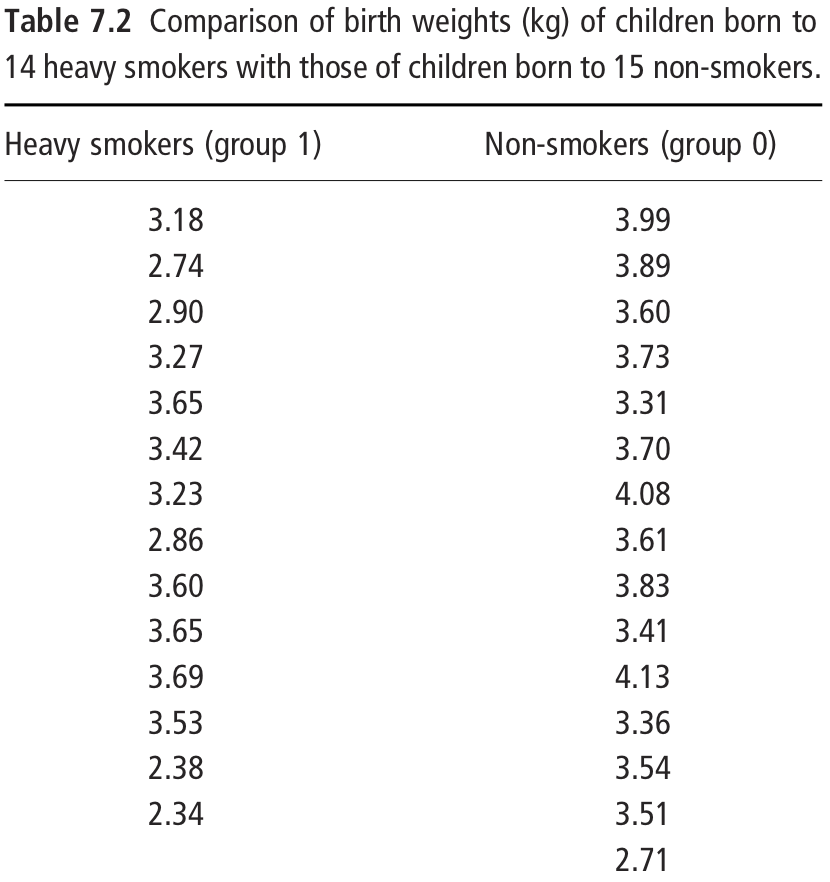
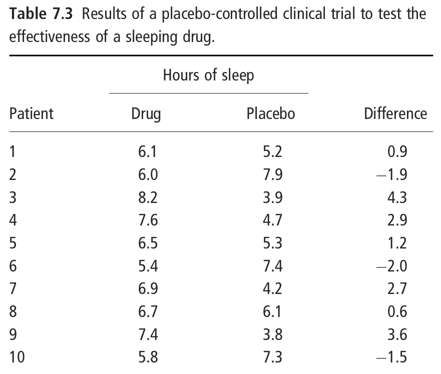

<style>
.forceBreak { -webkit-column-break-after: always; break-after: column; }
</style>

<style>
.vertical-center {
  margin: 0;
  position: absolute;
  top: 50%;
  -ms-transform: translateY(-50%);
  transform: translateY(-50%);
}
</style>

```{r include = FALSE}
knitr::opts_chunk$set(echo = FALSE, warning = FALSE, message = FALSE, cache = TRUE)
## knitr::opts_knit$set(global.device = TRUE)
library(viridis)
library(tidyverse)
library(kableExtra)
options("kableExtra.html.bsTable" = TRUE, knitr.kable.NA = "")

```

## This week {.flexbox .vcenter}

| Time                   | Session                   | Topic                                                                    |
| -----------------------|---------------------------|--------------------------------------------------------------------------|
| Mon 21 Oct 10:00-11:00  | Tutorial                  | Tutorial sheet 2 review: Using the normal distribution                           |
| Mon 21 Oct 11:15-12:15  | Lecture                   | Hypothesis testing, t-tests, linear regression                                 | 
| Mon 21 Oct 14:00-15:30  | Applied Statistics Lab    | Project 1: Epidemiology and determinants of high blood pressure          |
| Weds 23 Oct 9:30-11:00  | R Statistical Computing   | Data visualisation                                                   |
| Weds 23 Oct 14:00-15:30  | Maths Refresher           | Calculus III: Ordinary differential equations                                                   |


## Learning Objectives

* Articulate, interpret, and report statistical hypothesis tests.
* Apply the t-test for comparisons of means from two populations.
* Describe simple linear regression and name the assumptions on which it is based.
* Interpret linear regression coefficients, their confidence intervals, and significance tests.
* Fit linear regression models in R and check the assumptions of the regression model.


## Readings

Kirkwood and Sterne:

* Chapter 8: Using _P_-values and confidence intervals to interpret the results of statistical analyses
* Chapter 9: Comparison of means from several groups: analysis of variance
* Chapter 10: Linear regression and correlation
* Chapter 11: Multiple regression
* Chapter 12: Goodness of fit and regression diagnostics
* Chapter 13: Transformations

Supplementary:

* Bland JM, Altman DG. (1994) Regression towards the mean. 308, 1499.
* Bland JM, Altman DG. (1994) Some examples of regression towards the mean. 309, 780.


## {.flexbox .vcenter .centered}

<font size="10">**Hypothesis testing**</font>

  
## A simple hypothesis {.build}

<div>
<font size="5">
**Hypothesis:** All adult men in the UK are over 190cm tall.
</font>
</div>
<br>
<div>
Two approaches to investigate:

* Prove the hypothesis:
  * Find out the height of every man in the UK and confirm that all are >190cm.
</div>
<div>
* Disprove the hypothesis:
  * Find one adult male in the UK who is not taller than 190cm.
</div>
<br>
<div>
* Science is the process of systematically disproving hypotheses (Karl Popper).
* Statistical methods formalizes this idea.
</div>

## The 'null' hypothesis {.build}

<div>
<font size="5">
**Null hypothesis:** Hypothesis that there is no difference between groups or no association between variables.
</font>
</div>

<div>
Examples:

* H~0~: Drug A has no effect on cancer survival compared to Drug B.
* H~0~: Using fertilizer does not increase crop yield compared to no fertilizer.
</div>
<div>
Testing the hypothesis: Assess whether the data are consistent what we would have been expected _if the null hypothesis were true._
</div>
<div>
  * **No:** Data are not consistent with no difference  &rightarrow; _Reject_ (disprove) the null hypothesis; accept the alternative that there is a difference.
  * **Yes:** Data are consistent with no difference &rightarrow; _Fail to reject_ the null hypothesis; no evidence that there is a difference.
</div>
<div>
* We can only reject _(disprove)_ the null hypothesis.
* We never accept _(prove)_ the null hypothesis, only _fail to reject_.
  * Other outcomes could be consistent with our data (e.g. a small difference)
</div>


## A more subtle hypothesis {.build}

<div>
<font size="5">
**Research question:** Is the average height of adult men in the UK greater than 170cm?
</font>
</div>
<div>
* __Null hypothesis (H0):__ Average height of men in the UK &leq;170cm.
* __Alternative hypothesis (H1):__ Average height of men in the UK >170cm.
</div>

```{r}
set.seed(6763147)
mheight <- rnorm(10, 171.5, 6.5)
```
<div>

<br>

**Data:** Measure height of 10 adult men in the UK.
</div>
<div class="centered">
$x = `r round(mheight, 1)`$
</div>

$$\overline x = `r round(mean(mheight), 1)`$$ 
$$s = SD(x) = `r round(sd(mheight), 1)`$$

<div>
Is observing a sample mean $\overline x = `r round(mean(mheight), 1)`$ _consistent_ with $\mu\leq 170$?
</div>
<div>
What is _probability_ of observing $\overline x \geq `r round(mean(mheight), 1)`$ if $\mu = 170$?
</div>

## A more subtle hypothesis {.columns-2 .build}

<div>
If H~0~ is true $\mu_0$ = 170cm:
$$\overline x \sim \mathrm{Normal}\left(\mu_0, \frac{\sigma}{\sqrt{n}}\right)$$

```{r, fig.height=3.5, fig.width=5, out.width="80%"}
mu0 <- 170
sigma <- 6.5
n <- 10
se <- sigma / sqrt(n)

xlim <- c(163, 177)

mu0dens <- ggplot(data.frame(height = xlim), aes(height)) +
  theme_bw() +
  theme(panel.grid = element_blank()) +
  scale_x_continuous(expression(atop(paste("Sample mean ", bar(x)), ))) +
  ylab("Probability density") +
  stat_function(fun = dnorm,
                args = list(mean = mu0, sd = se),
                color = "red3", size = 1.2) +
  annotate("segment", x = mu0, xend = mu0, y = 0, yend = 1.0 * dnorm(0, sd = se),
           size = 1.0, color = "darkgreen", linetype = "dashed") +
  annotate("text", label = "mu[0]", x = mu0 - 0.3*se, y = 0.3*dnorm(0, sd = se), parse = TRUE, size = 4) +
  annotate("segment", x = mu0, xend = mu0 + se, y = dnorm(1) / se, yend = dnorm(1) / se,
           size = 1.0, color = "darkgreen", linetype = "dashed") +
  annotate("text", label = "frac(sigma, sqrt(n))", x = mu0 + 0.5*se, y = 0.85 * dnorm(1) / se , parse = TRUE, size = 4)

mu0dens
```
</div>

<p class="forceBreak"></p>

<div>
H~0~: $\frac{\mu_0 - 170}{\sigma} = 0$:
$$t = \frac{\overline x - \mu_0}{s/\sqrt{n}} \sim \textrm{Student-t}(df=n-1)$$

```{r, fig.height=3.5, fig.width=5, out.width="80%"}

xlim_t <- c(-3.5, 3.5)

t0dens <- ggplot(data.frame(t = xlim_t), aes(t)) +
  theme_bw() +
  theme(panel.grid = element_blank()) +
  xlab(expression(paste(t == frac(bar(x) - mu[0], s/sqrt(n)), ", ", df == n-1))) +
  ylab("Probability density") +
  stat_function(fun = dt,
                args = list(df = n - 1),
                color = "red3", size = 1.2)
t0dens
```
</div>

## A more subtle hypothesis {.build}

H0: $\mu \leq 170$

<div class="centered">
Data: $x = `r round(mheight, 1)`$

$\overline x = `r round(mean(mheight), 1)`$ &emsp; $s = `r round(sd(mheight), 1)`$
</div>

<div class="columns-2">
```{r, fig.height=3, fig.width=4, out.width="90%"}
t0 <- (mean(mheight) - mu0)/(sd(mheight)/sqrt(n))

t0dens +
  annotate("point", x=t0, y=0, color = "darkred", size=4)
```

<p class="forceBreak"></p>

$$t_0 = \frac{\overline x - \mu_0}{\sigma / \sqrt{n}} = \frac{`r round(mean(mheight), 1)` - `r mu0`}{`r round(sd(mheight), 1)`/\sqrt{`r n`}} = `r round(t0, 2)`$$

</div>


## A more subtle hypothesis

<div>
H0: $\mu \leq 170$

<div class = "centered">
Data: $x = `r round(mheight, 1)`$

$\overline x = `r round(mean(mheight), 1)`$ &emsp; $s = `r round(sd(mheight), 1)`$
</div>

<div class="columns-2">
```{r, fig.height=3, fig.width=4, out.width="90%"}
x <- mheight
t0 <- (mean(mheight) - mu0)/(sd(mheight)/sqrt(n))

t0dens +
   stat_function(fun = dt,
                xlim = c(t0, xlim_t[2]),
                args = list(df = n - 1),
                geom = "area",
                fill = "red3", alpha = 0.5) +
  annotate("point", x=t0, y=0, color = "darkred", size=4)
  
```

<p class="forceBreak"></p>

$$t_0 = \frac{\overline x - \mu_0}{\sigma / \sqrt{n}} = \frac{`r round(mean(mheight), 1)` - `r mu0`}{`r round(sd(mheight), 1)`/\sqrt{`r n`}} = `r round(t0, 2)`$$
<br>

$P(t \geq t_0\ |\ df = 9) = `r round(pt(t0, df = n-1, lower.tail = FALSE), 3)`$

* Probability observing test statistic as large as $t_0$ if the null hypothesis is true: _p-value_.
* "One-sided" p-value

## Interpreting p-values {.build}

<div>
* _Test statistic_: Function of sample data measuring how far our observation is from null value of 0.
* _p-value_: Probability observing test statistic as large as $t_0$ _assuming the null hypothesis is true_
* Larger test statistic &rightarrow; Smaller _p_-value &rightarrow; stronger evidence _against_ the null hypothesis of no association.
</div>

<div>
Example interpretations:

* _p_ = 0.1: Reasonable chance of observing data if null hypothesis were true &rarr; data **do not** provide evidence against the null hypothesis.
* _p_ = 0.001: Very small probability of observing data if null hypothesis were true &rarr; data provide **strong evidence** against the null hypothesis.
</div>

<div>
* Convention: if $p < \alpha$, **reject** the null hypothesis, declare association **statistically significant**.
  * Level $\alpha$ is the pre-determined acceptable level for **rejecting** the null hypothesis when if it is true (_"Type 1 error rate"_: probability of erroneously detecting an association.)
  * $\alpha$ **must** be determined _a priori_ before calculating test statistic. Arbitrary convention: $\alpha = 0.05$
  * Size of _p_-value does not indicate anything about the _magnitude_ or medical significance of an association.
</div>

## One-sided t-tests in R 

__H0:__ Average height $\mu \leq 170$.

__H1:__ Average height $\mu > 170$.

<div class="columns-2">
<div class = "build">
```{r, echo = TRUE}
x <- c(170.0, 182.9, 182.3, 176.6, 172.4, 
       180.9, 168.9, 177.8, 159.6, 173.1)
xbar <- mean(x); 
s <- sd(x); 
n <- length(x)

t_stat <- (xbar - 170) / (s / sqrt(n))
```

```
> t_stat
[1] 1.952236

> pt(t_stat, df = n-1, lower.tail = FALSE)
[1] 0.04133462
```

```{r, echo=TRUE, eval = FALSE}
> t.test(x, alternative = "greater", mu = 170)
```

```
	One Sample t-test

data:  x
t = 1.9522, df = 9, p-value = 0.04133
alternative hypothesis: true mean is greater than 170
95 percent confidence interval:
 170.2715      Inf
sample estimates:
mean of x 
   174.45 
```
</div>
</div>

## Two-sided p-value {.build}

Is the average height of men in the UK exactly equal to 170cm?

* Null hypothesis: average height of men in the UK $\mu$ = 170cm.
* Alternative hypothesis: average height of men in the UK $\mu$ &ne; 170cm.

<div class="columns-2">
```{r, fig.height=3, fig.width=4, out.width="90%"}
t0dens +
   stat_function(fun = dt,
                xlim = c(t0, xlim_t[2]),
                args = list(df = n - 1),
                geom = "area",
                fill = "red3", alpha = 0.5) +
     stat_function(fun = dt,
                xlim = c(xlim_t[1], -t0),
                args = list(df = n - 1),
                geom = "area",
                fill = "red3", alpha = 0.5) +
  annotate("point", x=t0, y=0, color = "darkred", size=4) +
  annotate("point", x=-t0, y=0, color = "darkred", size=4)
```
<p class="forceBreak"></p>

$$t_0 = \frac{\overline x - \mu_0}{\sigma / \sqrt{n}} = \frac{`r round(mean(mheight), 1)` - `r mu0`}{`r round(sd(mheight), 1)`/\sqrt{`r n`}} = `r round(t0, 2)`$$
<br>
$$
\begin{aligned}
P(t \geq t_0\ \textrm{or}\ t \leq -t_0) &= P(t \geq t_0) + P(t \leq -t_0) \\
 &=`r round(pt(t0, df = n-1, lower.tail = FALSE), 3)` + `r round(pt(t0, df = n-1, lower.tail = FALSE), 3)` \\
 &=`r round(2*pt(t0, df = n-1, lower.tail = FALSE), 3)`
\end{aligned}
$$

</div>

## Two-sided p-value in R

__H0:__ Average height $\mu = 170$.

__H1:__ Average height $\mu \neq 170$.

<div class="columns-2">
<div class = "build">
```{r, echo = TRUE}
x <- c(170.0, 182.9, 182.3, 176.6, 172.4, 
       180.9, 168.9, 177.8, 159.6, 173.1)
xbar <- mean(x); 
s <- sd(x); 
n <- length(x)

t_stat <- (xbar - 170) / (s / sqrt(n))
```

```
> t_stat
[1] 1.952236

> pt(-t_stat, df = n-1) + 
    pt(t_stat, df = n-1, lower.tail = FALSE)
[1] 0.08266924
> 2 * pt(t_stat, df = n-1, lower.tail = FALSE)
[1] 0.08266924
```

```{r, echo=TRUE, eval = FALSE}
## t.test(x, alternative = "both", mu = 170)
t.test(x, mu = 170)
```

```
> t.test(x, mu = 170)

	One Sample t-test

data:  x
t = 1.9522, df = 9, p-value = 0.08267
alternative hypothesis: true mean is not equal to 170
95 percent confidence interval:
 169.2936 179.6064
sample estimates:
mean of x 
   174.45 
```
</div>
</div>

## Comparing means for two groups {.columns-2 .build}

```{r ems_ex7.2_data}
## Kirkwood and Sterne, Example 7.2
smokers <- c(3.18, 2.74, 2.90, 3.27, 3.65, 3.42, 3.23, 2.86, 3.60, 3.65, 3.69, 3.53, 2.38, 2.34)
nonsmokers <- c(3.99, 3.89, 3.60, 3.73, 3.31, 3.70, 4.08, 3.61, 3.83, 3.41, 4.13, 3.36, 3.54, 3.51, 2.71)
```
```{r ems_ex7.2}
xbar1 <- mean(smokers); xbar0 <- mean(nonsmokers)
s1 <- sd(smokers); s0 <- sd(nonsmokers)
n1 <- length(smokers); n0 <- length(nonsmokers)

xbar_diff <- xbar1 - xbar0
s_pooled <- sqrt(((n1-1)*s1^2 + (n0-1)*s0^2) /
                   (n1+n0-2))
se_diff <- s_pooled * sqrt(1/n1 + 1/n0)

t_stat <- (xbar1 - xbar0) / (se_diff)
```

* Example: Is there a difference in birthweight between heavy smokers during pregnancy and non-smokers? 
* H0: There is no difference in the birthweight for children of heavy smokers ($\mu_1$) and children of non-smokers ($\mu_0$).
  * H0: $\mu_1 = \mu_0$
  * H0: $\mu_1 - \mu_0 = 0$

<br>

<div>
* Data: measured birthweight (kg) among children of 14 heavy smokers and 15 non-smokers.  

<div class="centered">
$\overline x_1 = `r round(xbar1, 3)`$ &emsp; $\overline x_0 = `r round(xbar0, 3)`$  
$s_1 = `r round(s1, 3)`$ &emsp; $s_0 = `r round(s0, 3)`$  
$n_1 = `r n1`$ &emsp;&ensp; $n_0 = `r n0`$
</div>

<p class="forceBreak"></p>

<div class="centered">
  
</div>
</div>

## Comparing means for two groups {.build}

<div>
* Estimate for magnitude of effect---difference in sample means:
$$\overline x_1 - \overline x_0 = `r round(xbar1, 3)` - `r round(xbar0, 3)` = `r round(xbar1 - xbar0, 3)` \textrm{kg}$$
</div>
<div>
* Assume two groups have equal population standard deviation.
  * Calculate combined SD:
  <font size="3">
  $$s = \sqrt{\frac{(n_1-1)s_1^2 + (n_0-1)s_0^2}{(n_1+n_0-2)}} = 
      \sqrt{\frac{`r n1-1`\cdot `r round(s1, 3)`^2 + `r n0-1`\cdot `r round(s0, 3)`^2}{`r n1` + `r n0` -  2}} =
      `r round(s_pooled, 3)` \textrm{kg}$$
  </font>
  * Standard error for difference in sample means $\overline x_1 - \overline x_0$:
  <font size="3">
  $$s.e. = s\cdot\sqrt{1/n_1 + 1/n_0} = `r round(s_pooled, 3)`\cdot\sqrt{1/`r n1` + 1/`r n0`} = `r round(se_diff, 3)` \textrm{kg}$$
  </font>
</div>
<div>
* $t = \frac{\sqrt{\overline x_1 - \overline x_0}}{s.e.}$ has _t_-distribution with $df = n_1+n_0-2$
  * 95% CI: $(\overline x_1 - \overline x_0) \pm t'_{df, 0.975} \cdot s.e. = `r round(xbar_diff, 3)` \pm `r round(qt(0.975, n1+n0-2), 3)` \cdot `r round(se_diff, 3)` = 
  (`r round(xbar_diff - qt(0.975, n1+n0-2)*se_diff, 3)`, 
   `r round(xbar_diff + qt(0.975, n1+n0-2)*se_diff, 3)`)$
  * $t_0 = `r round(xbar_diff, 3)` / `r round(se_diff, 3)` = `r round(t_stat, 3)`$
  * _P_-value: $2 \cdot P(t > |t_0|) = `r round(2 * pt(t_stat, n1+n0-2), 3)`$
</div>

## Two sample t-test in R {.build}

<div>
```{r ems_ex7.2_data, echo = TRUE, eval = FALSE}
``` 

<div class="columns-2">
```{r ems_ex7.2, echo = TRUE, eval = FALSE}
``` 

<p class="forceBreak"></p>

```
> xbar_diff
[1] -0.452381

> ## 95% confidence interval
> xbar_diff + c(-1, 1) * qt(0.975, n1+n0-2) * se_pooled
[1] -0.7666542 -0.1381077

> t_stat
[1] -2.953509

> ## two-sided p-value
> 2 * pt(t_stat, n1+n0-2)
[1] 0.006437305
```
</div>
</div>

<div>
* Estimate that birthweight for babies born to heavy smokers are about 0.45kg lower than birthweight of babies of non-smokers (95% CI 0.14--0.77kg).
* _P_-value _p_ = 0.006 indicates we would be very unlikely to observe such a large difference if there was no true difference &rarr; strong evidence to reject the null hypothesis of no difference in birthweight.
</div>

## Two sample t-test in R {.columns-2}

```{r ems_ex7.2, echo = TRUE, eval = FALSE}
```

```
> xbar_diff
[1] -0.452381

> ## 95% confidence interval
> xbar_diff + 
    c(-1, 1) * qt(0.975, n1+n0-2) * se_pooled
[1] -0.7666542 -0.1381077

> t_stat
[1] -2.953509

> ## two-sided p-value
> 2 * pt(t_stat, n1+n0-2)
[1] 0.006437305
```

<p class="forceBreak"></p>

```{r, echo = TRUE, results ="verbatim"}
t.test(smokers, nonsmokers, var.equal = TRUE)
```

## Comparing means with unequal population SD {.build}

<div>
* If believe the **standard deviation** is different between two groups, or large difference in sample standard deviation (e.g. >2x greater), assumption of same standard deviation between groups may be innappropriate.
</div>
<div>
* Welch's t-test / unequal variance t-test: 
  * Denominator _not_ based on pooled variance estimate:
   $$t = \frac{\overline x_1 - \overline x_0}{\sqrt{\frac{s_1^2}{n_1} + \frac{s_2^0}{n_0}}}$$ 
  * Approximation for degrees of freedom:
   $$ df \approx \frac{\left({\frac{s_1^2}{n_1}} + \frac{s_0^2}{n_0}\right)^2}{\frac{s_1^4}{n_1^2(n_1-1)} + \frac{s_0^4}{n_0^2(n_0-1)}} $$
</div>

## Comparing means with unequal population SD

<div>
* Unequal variance assumption is the default in R when calling `t.test(x, y)`. 
  * Argument `t.test(..., var.equal = FALSE)`.
  * Slightly wider CIs; slightly larger p-value.
  * Performs relatively well even when variance is the same.
</div>

<br>
<div class="columns-2">

 Equal variance assumption:
 
 ```
 > t.test(smokers, nonsmokers, var.equal = TRUE)

### <b>
	Two Sample t-test
### </b>

data:  smokers and nonsmokers
### <b>
t = -2.9535, df = 27, p-value = 0.006437
### </b>
alternative hypothesis: true difference in means is not equal to 0
95 percent confidence interval:
### <b>
 -0.7666542 -0.1381077
 ### </b>
sample estimates:
mean of x mean of y 
 3.174286  3.626667 
 ```
 <p class="forceBreak"></p>   
Unequal variance assumption:  

```
> t.test(smokers, nonsmokers, var.equal = FALSE)

### <b>
	Welch Two Sample t-test
### </b>

data:  smokers and nonsmokers
### <b>
t = -2.9271, df = 24.489, p-value = 0.007281
### </b>
alternative hypothesis: true difference in means is not equal to 0
95 percent confidence interval:
### <b>
 -0.7710160 -0.1337459
 ### </b>
sample estimates:
mean of x mean of y 
 3.174286  3.626667 
 ```
</div>

## Paired t-test {.build}

<div>
* Data often consist of _paired_ observations.
  * Two observations of different exposures on same individual (e.g. treatment A & treatment B).
  * Observations in different groups matched on key characteristics (e.g. age, sex).
</div>
<div>
* Calculate _difference_ within each pair.
  * Differences become observations.
  * Sample size: number of pairs.
  * Paired t-test = one-sample t-test on differences
</div>
<div>
* Typically, pairing **reduces** standard error for difference &rarr; reduce _p_-value compared to two-sample test.
  * If pairs are 'well matched'.
  * Each pair acts as it's own 'control': removes other sources of variation &rarr; Isolates effect treatment difference.
</div>

## Paired t-test example {.columns-2 .build}

```{r ems_ex7.3_data}
## Kirkwood and Sterne, Example 7.3
sleep <- data.frame(patient = 1:10,
                    drug = c(6.1, 6.0, 8.2, 7.6, 6.5, 5.4, 6.9, 6.7, 7.4, 5.8),
                    placebo = c(5.2, 7.9, 3.9, 4.7, 5.3, 7.4, 4.2, 6.1, 3.8, 7.3))
```
```{r ems_ex7.3}
diff <- sleep$drug - sleep$placebo
xbar1 <- mean(sleep$drug); xbar0 <- mean(sleep$placebo)

xbar_diff <- mean(diff)  # equivalent: xbar1 - xbar0
s <- sd(diff)
se_diff <- s / sqrt(nrow(sleep))

t_stat <- mean(diff) / (se_diff)
```
<div>
* Example: Does a new sleeping drug improve number of hours of sleep per night?
* H0: No difference in the average number of hours sleep per night for patients who receive the drug compared to placebo.
</div>
<div>
* Data: Ten patients observed one night with drug, one night with placebo. Outcome is number of hours slept.

<div class="centered">
  
</div>
</div>

<p class="forceBreak"></p>
  
<div>
* Estimated magnitude of effect:  
<br>
<div class="centered">
<p>$\overline{\textrm{drug}} = `r round(xbar1, 2)`$ &emsp; $\overline{\textrm{placebo}} = `r round(xbar0, 2)`$</p>  
$\overline{\textrm{drug}} - \overline{\textrm{placebo}} = `r round(xbar1 - xbar0, 2)`$
</div>
</div>
<div>
* Standard error and 95% CI:  

<div class="centered">
$s = SD(diff) = `r round(s, 2)`$  

$n = `r nrow(sleep)`$ &emsp; $df = n-1 = `r nrow(sleep)-1`$  

s.e. = $`r round(s, 2)` / \sqrt{`r nrow(sleep)`} = `r round(se_diff, 2)`$  

95% CI = $`r round(xbar_diff, 2)` \pm `r round(qt(0.975, nrow(sleep)-1), 2)` \cdot `r round(se_diff, 2)` = 
(`r round(xbar_diff - qt(0.975, nrow(sleep)-1) * se_diff, 2)`, `r round(xbar_diff + qt(0.975, nrow(sleep)-1) * se_diff, 2)`)$
</div>
</div>
<div>
* Test statistic and p-value:  

<div class="centered">
$t_0 = `r round(xbar_diff, 2)` / `r round(se_diff, 2)` = `r round(t_stat, 3)`$  

_p_-value = `r round(2 * pt(abs(t_stat), nrow(sleep)-1, lower.tail = FALSE), 3)`
</div>
</div>

## Paired t-test in R

```{r, echo = TRUE, eval = FALSE}
sleep <- data.frame(patient = 1:10,         ## Kirkwood and Sterne, Example 7.3
                    drug = c(6.1, 6.0, 8.2, 7.6, 6.5, 5.4, 6.9, 6.7, 7.4, 5.8),
                    placebo = c(5.2, 7.9, 3.9, 4.7, 5.3, 7.4, 4.2, 6.1, 3.8, 7.3))
diff <- sleep$drug - sleep$placebo
xbar_diff <- mean(diff)  # equivalent: xbar1 - xbar0
se_diff <- sd(diff) / sqrt(nrow(sleep))

t_stat <- xbar_diff / se_diff
2 * pt(abs(t_stat), df=nrow(sleep)-1, lower.tail = FALSE)
```

Equivalent results: paired t-test and one-sample t-test on differences

<div class="columns-2">
```
> t.test(sleep$drug, sleep$placebo, paired = TRUE)

	Paired t-test

data:  sleep$drug and sleep$placebo
t = 1.4795, df = 9, p-value = 0.1731
alt. hypothesis: true difference != 0
95 percent confidence interval:
 -0.5712886  2.7312886
sample estimates:
mean of the differences 
                   1.08 
```

```
> t.test(sleep$drug - sleep$placebo)

	One Sample t-test

data:  sleep$drug - sleep$placebo
t = 1.4795, df = 9, p-value = 0.1731
alt. hypothesis: true difference != 0
95 percent confidence interval:
 -0.5712886  2.7312886
sample estimates:
mean of x 
     1.08 
```
</div>

<!-- ## {.flexbox .vcenter .centered} -->

<!-- <font size="10">**Analysis of variance**</font> -->

<!-- ## Another perspective on comparing two groups -->


## {.flexbox .vcenter .centered}

<font size="10">**Linear regression**</font>
  
## Linear regression

<div class="columns-2">
```{r ems_ex10.1}
ems_ex10_1 <- data.frame(subject = 1:8,
                         weight = c(58, 70, 74, 63.5, 62, 70.5, 71, 66),
                         plasma = c(2.75, 2.86, 3.37, 2.76, 2.62, 3.49, 3.05, 3.12)) 

lm_ex10_1 <- lm(plasma ~ weight, ems_ex10_1)

ems_ex10_1$fitted <- lm_ex10_1$fitted.values

gg_ex10_1 <- ggplot(ems_ex10_1, aes(weight, plasma)) +
  geom_point() +
  theme_bw() +
  scale_x_continuous("Body weight (kg)", limits = c(55, 75)) +
  scale_y_continuous("Plasma volume (litres)", limits = c(2.5, 3.5)) +
  theme(panel.grid = element_blank())

ems_ex10_1 %>%
  select(-fitted) %>%
  knitr::kable(align="c", col.names = c("Subject", "Body weight (kg)", "Plasma\nvolume (litres)")) %>%
  kable_styling(bootstrap_options = "striped", full_width = FALSE)

```

<p class="forceBreak"></p>

Measurements of body weight and blood plasma volume in eight healthy men.  

```{r, fig.height = 3, fig.width = 4, out.width="100%"}
gg_ex10_1
```
</div>

## Linear regression 

<div class="columns-2">
```{r ems_ex10.1}
```
<p class="forceBreak"></p>

Measurements of body weight and blood plasma volume in eight healthy men.  

```{r, fig.height = 3, fig.width = 4, out.width="100%"}
gg_ex10_1 +
  geom_smooth(method = "lm", se = FALSE, color = "darkred", fullrange = TRUE)
```
</div>

## Linear regression {.columns-2}

<br>
<br>
<br>
<font size="5">
$$y = \beta_0 + \beta_1 x$$
</font>
<br>
<br>

* $\beta_0$ and $\beta_1$ called _regression coefficients_.
  * $\beta_0$ = intercept: value of $y$ when $x = 0$.
  * $\beta_1$ = slope: change in $y$ per 1 unit change in $x$.

<p class="forceBreak"></p>

Measurements of body weight and blood plasma volume in eight healthy men.  

```{r, fig.height = 3, fig.width = 4, out.width="100%"}
gg_ex10_1 +
  geom_smooth(method = "lm", se = FALSE, color = "darkred", fullrange = TRUE) +
  geom_point(color = "grey") +
  annotate("segment", x = 65, xend = 67, 
           y = coef(lm_ex10_1) %*% c(1, 65), 
           yend = coef(lm_ex10_1) %*% c(1, 65)) +
  annotate("segment", x = 67, xend = 67, 
           y = coef(lm_ex10_1) %*% c(1, 65), 
           yend = coef(lm_ex10_1) %*% c(1, 67)) +
  annotate("text", label = 1,
           x = 66, y = coef(lm_ex10_1) %*% c(1, 65) * 0.985) +
    annotate("text", label = "beta[1]",  parse = TRUE,
           x = 67.8, y = coef(lm_ex10_1) %*% c(1, 66))
             

```


## Estimating regression parameters {.columns-2}

<br>
$$
\begin{aligned}
y_i = \beta_0 + \beta_1 x_i + \epsilon_i \\
\epsilon_i \sim \mathrm{Normal(0, \sigma)}
\end{aligned}
$$
<br>


<p class="forceBreak"></p>

Measurements of body weight and blood plasma volume in eight healthy men.  

```{r fig_lsq, fig.height = 3, fig.width = 4, out.width="100%"}
gg_ex10_1 +
  geom_smooth(method = "lm", se = FALSE, color = "darkred", fullrange = TRUE) +
  geom_segment(aes(xend = weight, yend = fitted), linetype = "dashed") 
```

## Estimating regression parameters {.columns-2}

<br>
$$
\begin{aligned}
y_i = \beta_0 + \beta_1 x_i + \epsilon_i \\
\epsilon_i \sim \mathrm{Normal(0, \sigma)}
\end{aligned}
$$
<br>

Estimating parameters via least squares:

* Find values $\hat \beta_0$ and $\hat \beta_1$ that minimize the _residual sum of squares_:
  $$RSS = \sum_{i=1}^n \epsilon_i^2 = \sum_{i=1}^n \left(y_i - (\beta_0 + \beta_1x_i)\right)^2$$


<p class="forceBreak"></p>

Measurements of body weight and blood plasma volume in eight healthy men.  

```{r fig_lsq, fig.height = 3, fig.width = 4, out.width="100%"}
```

## Estimating regression parameters {.columns-2}

<br>
$$
\begin{aligned}
y_i = \beta_0 + \beta_1 x_i + \epsilon_i \\
\epsilon_i \sim \mathrm{Normal(0, \sigma)}
\end{aligned}
$$
<br>

Estimating parameters via least squares:

* Find values $\hat \beta_0$ and $\hat \beta_1$ that minimize the _residual sum of squares_:
  $$RSS = \sum_{i=1}^n \epsilon_i^2 = \sum_{i=1}^n \left(y_i - (\beta_0 + \beta_1x_i)\right)^2$$
  
* Satisfied by:

$$\hat \beta_1 = \frac{\sum (x_i - \overline x)(y_i - \overline y)}{\sum (x_i - \overline x)^2}$$
$$\hat \beta_0 = \overline y - \hat \beta_1 \overline x$$

<p class="forceBreak"></p>

Measurements of body weight and blood plasma volume in eight healthy men.  

```{r fig_lsq, fig.height = 3, fig.width = 4, out.width="100%"}
```

## Linear regression in R

```{r, echo = TRUE}
pv <- data.frame(subject = 1:8,
                 weight = c(58, 70, 74, 63.5, 62, 70.5, 71, 66),
                 plasma = c(2.75, 2.86, 3.37, 2.76, 2.62, 3.49, 3.05, 3.12)) 
xbar <- mean(pv$weight)
ybar <- mean(pv$plasma)

beta1_hat <- sum((pv$weight - xbar) * (pv$plasma - ybar)) / sum((pv$weight - xbar)^2)
beta0_hat <- ybar - beta1_hat * xbar
```
<div class="columns-2">
```{r, echo = TRUE, results = "verbatim"}
beta0_hat
beta1_hat
```
<p class="forceBreak"></p>
```{r, echo = TRUE, fig.height=3, fig.width=4, out.width="70%", fig.align = "center"}
ggplot(pv, aes(x = weight, y = plasma)) + geom_point() +
  geom_abline(slope = beta1_hat, intercept = beta0_hat)
```
</div>

## Linear regression in R {.build}

<div>
```{r, echo = TRUE}
pv <- data.frame(subject = 1:8,
                 weight = c(58, 70, 74, 63.5, 62, 70.5, 71, 66),
                 plasma = c(2.75, 2.86, 3.37, 2.76, 2.62, 3.49, 3.05, 3.12)) 
xbar <- mean(pv$weight)
ybar <- mean(pv$plasma)

beta1_hat <- sum((pv$weight - xbar) * (pv$plasma - ybar)) / sum((pv$weight - xbar)^2)
beta0_hat <- ybar - beta1_hat * xbar
```

<br>

* Best fitting regression line: **Plasma volume = `r round(beta0_hat, 3)` + `r round(beta1_hat, 3)` &times; weight**

* Interpretation: _Amongst our sample of eight men,_ for every 1 kilogram greater weight, plasma volume increases by an average of `r round(beta1_hat, 3)`  litres.
</div>
<div>
<br>

* What about the association between weight and plasma volume in the population?

## Standard error of regression coefficients {.columns-2}

<font size="5">
$$
\begin{aligned}
y_i = \beta_0 + \beta_1 x_i + \epsilon_i \\
\epsilon_i \sim \mathrm{Normal(0, \sigma)}
\end{aligned}
$$
</font>

* Estimate of $\sigma$ depends on the _residual sum of squares)_ (RSS).  
$$\hat\sigma = s = \sqrt{\frac{RSS}{df}} = \sqrt{\frac{\sum (y_i - (\hat\beta_0 + \hat\beta_1 x_i))^2}{n-2}}$$
  * df = $n - k$: Observations -  parameters.

<p class="forceBreak"></p>

Measurements of body weight and blood plasma volume in eight healthy men.  

```{r fig_lsq, fig.height = 3, fig.width = 4, out.width="100%"}
```


## Standard error of regression coefficients {.columns-2}

<font size="5">
$$
\begin{aligned}
y_i = \beta_0 + \beta_1 x_i + \epsilon_i \\
\epsilon_i \sim \mathrm{Normal(0, \sigma)}
\end{aligned}
$$
</font>

* Estimate of $\sigma$ depends on the _residual sum of squares)_ (RSS).  
$$\hat\sigma = s = \sqrt{\frac{RSS}{df}} = \sqrt{\frac{\sum (y_i - (\hat\beta_0 + \hat\beta_1 x_i))^2}{n-2}}$$
  * df = $n - k$: Observations -  parameters.
  
* Standard error of regression coefficients:
$$\mathrm{s.e.}(\hat \beta_1) = \frac{\hat \sigma}{\sqrt{\sum (x_i - \overline x)^2}}$$
$$\mathrm{s.e.}(\hat \beta_0) = \hat\sigma\cdot\sqrt{\frac{1}{n} + \frac{\overline x^2}{\sum (x_i - \overline x)^2}}$$

<p class="forceBreak"></p>

Measurements of body weight and blood plasma volume in eight healthy men.  

```{r fig_lsq, fig.height = 3, fig.width = 4, out.width="100%"}
```

## Linear regression in R

<div>
```{r, echo = TRUE}
pv <- data.frame(subject = 1:8,
                 weight = c(58, 70, 74, 63.5, 62, 70.5, 71, 66),
                 plasma = c(2.75, 2.86, 3.37, 2.76, 2.62, 3.49, 3.05, 3.12)) 
xbar <- mean(pv$weight)
ybar <- mean(pv$plasma)

beta1_hat <- sum((pv$weight - xbar) * (pv$plasma - ybar)) / sum((pv$weight - xbar)^2)
beta0_hat <- ybar - beta1_hat * xbar

y_pred <- beta0_hat + beta1_hat * pv$weight
sigma_hat <- sqrt( sum((pv$plasma - y_pred)^2) / (nrow(pv) - 2))

se_beta1 <- sigma_hat / sqrt(sum((pv$weight - xbar)^2))
se_beta0 <- sigma_hat * sqrt(1/nrow(pv) + xbar^2 / sum((pv$weight - xbar)^2))
```
<div class="centered">
```{r, echo = FALSE}
rbind(beta0 = c(beta0_hat, se_beta0),
      beta1 = c(beta1_hat, se_beta1),
      sigma = c(sigma_hat, NA)) %>%
knitr::kable(align="c", col.names = c("Estimate", "S.E"), digits = 4) %>%
  kable_styling(bootstrap_options = "striped", full_width = FALSE)
```
</div>

## Hypothesis testing for regression coefficients {.build}

<div>
* Is plasma volume associated with weight?
  * H0: No assocoation between plasma volume and weight &harr; $\beta_1 = 0$.
  * H1: Plasma volume is associated with weight  &harr; $\beta_1 \neq 0$.
</div>
<div>
* Familiary looking ingredients...
```{r, echo = FALSE}
rbind(beta0 = c(beta0_hat, se_beta0),
      beta1 = c(beta1_hat, se_beta1),
      sigma = c(sigma_hat, NA)) %>%
knitr::kable(align="c", col.names = c("Estimate", "S.E"), digits = 4) %>%
  kable_styling(bootstrap_options = "striped", full_width = FALSE) %>%
  add_footnote(paste0("df = ", nrow(pv) - 2), "none")
               
```
</div>
<div>
* 95% CI for $\beta_1$: $\hat{\beta_1} \pm t'_{df, 0.975} \cdot \mathrm{s.e.}(\hat\beta_1) = 0.044 \pm 2.447 \cdot 0.015 = (0.006, 0.081)$

* t-statistic: $t_0 = \frac{\hat \beta_1}{\mathrm{s.e.}(\hat\beta_1)} = \frac{0.0436}{0.0153} = 2.86$ on 6 degrees of freedom.
* two-sided p-value = 0.0289
</div>


## Linear regression in R

```{r, echo = TRUE, results="verbatim"}
fit <- lm(plasma ~ weight, data = pv)
summary(fit)
```

## Linear regression assumptions

<font size="5">
$$
\begin{aligned}
y_i = \beta_0 + \beta_1 x_i + \epsilon_i \\
\epsilon_i \sim \mathrm{Normal(0, \sigma)}
\end{aligned}
$$
</font>

1. **Linearity**: Relationship between $y$ and $x$ is linear.

2. **Independence**: Residuals are uncorrelated.

2. **Normality**: Residuals follow a normal distribution.

3. **Constant variance**: Residuals have constant variance for all values of $y$.


## Checking assumptions: Residual analysis {.columns-2}

<br>
<br>
<br>

```{r fig.height = 3, fig.width = 4, out.width="95%", fig.align = "center"}
set.seed(47217619)
df <- data.frame(x = rnorm(500, 3, 1.5)) %>%
  mutate(y = rnorm(500, -0.5 + 0.5*x, 1.0),
         fitted = lm(y~x)$fitted.values,
         resid = y - fitted,
         zresid = resid / sd(resid)) %>%
  arrange(resid) %>%
  mutate(quantile = row_number()/n(),
         qnorm = pnorm(zresid))

df %>% 
  ggplot(aes(x,y)) +
  theme_bw() +
  theme(panel.grid = element_blank()) +
  geom_point(color = "grey30") +
  geom_smooth(method = "lm", color = "darkred", se = FALSE) +
  geom_segment(aes(xend = x, yend = fitted), linetype = "dashed", color = "darkred", alpha = 0.7)
```

<p class="forceBreak"></p>

```{r, fig.height = 3, fig.width = 4, out.width="70%", fig.align = "center"}
df %>% 
  ggplot(aes(sample = resid)) +
  theme_bw() +
  theme(panel.grid = element_blank()) +
  geom_qq(color = "navy") +
  geom_qq_line(linetype ="dashed") +
  ggtitle("Normal Quantile-Quantile Plot")

df %>%
  ggplot(aes(fitted, resid)) +
  theme_bw() +
  theme(panel.grid = element_blank()) +
  geom_hline(yintercept = 0, linetype = "dashed") +
  geom_point(color = "navy") +
  ggtitle("Residuals vs. fitted values")

```

## Normal Q-Q plot: checking normality

```{r, out.width="90%", fig.align = "center"}
set.seed(63461094)
dfqq <- data.frame(
samp1 = rnorm(500),
samp2 = rt(500, 3),
samp3 = exp(0.3 * rnorm(500))
) %>% 
  mutate(samp3 = (samp3 - mean(samp3)) / sd(samp3))

th <- list(theme_bw(),
           theme(panel.grid = element_blank()))
  
p1 <- dfqq %>% ggplot(aes(samp1)) + th + 
  xlim(-3, 3) +
  geom_histogram(aes(y = ..density..), fill = "navy") +
  stat_function(fun = dnorm,
                color = "red3", size = 1.2) +
  labs(title = "Good", x = element_blank())

p2 <- dfqq %>%
  ggplot(aes(sample = samp1)) + th +
  geom_qq() +
  geom_qq_line(color = "red3", linetype = "dashed")
  

p3 <- dfqq %>% ggplot(aes(samp2)) + th +
  xlim(-3, 3) +
  geom_histogram(aes(y = ..density..), fill = "navy") +
  stat_function(fun = dnorm,
                color = "red3", size = 1.2) +
  labs(title = "Heavy-tailed", x = element_blank())

p4 <- dfqq %>%
  ggplot(aes(sample = samp2)) + th +
  geom_qq() +
  geom_qq_line(color = "red3", linetype = "dashed")
  

p5 <- dfqq %>% ggplot(aes(samp3)) + th +
  xlim(-3, 3) +
  geom_histogram(aes(y = ..density..), fill = "navy") +
  stat_function(fun = dnorm,
                color = "red3", size = 1.2) +
  labs(title = "Positively skewed", x = element_blank())

p6 <- dfqq %>%
  ggplot(aes(sample = samp3)) + th + 
  geom_qq() +
  geom_qq_line(color = "red3", linetype = "dashed")
  

gridExtra::grid.arrange(p1, p3, p5, p2, p4, p6, nrow = 2)
```


## Residuals vs. fitted values

```{r, out.width="90%", fig.align = "center"}

set.seed(47217619)
df <- data.frame(x = rnorm(500, 0, 1.5)) %>%
  mutate(y1 = rnorm(500, -0.5 + 0.5*x, 1.0),
         y2 = rnorm(500, -0.5 + 0.5*x - 0.2*x^2, 1.0),
         y3 = rnorm(500, -0.5 + 0.5*x, 1.0 + 0.2 * (pmax(x, -3) + 4)),
         f1 = lm(y1 ~ x)$fitted.values,
         f2 = lm(y1 ~ x)$fitted.values,
         f3 = lm(y1 ~ x)$fitted.values, 
         r1 = y1 - f1,
         r2 = y2 - f2,
         r3 = y3 - f3)

p1 <- ggplot(df, aes(x, y1)) + th +
  geom_point(color = "navy") +
  geom_smooth(method = "lm", se = FALSE, color = "red3") +
  labs(title = "Good", x = "x", y = "y")

p2 <- ggplot(df, aes(x, y2)) + th +
  geom_point(color = "navy") +
  geom_smooth(method = "lm", se = FALSE, color = "red3") +
  labs(title = "Non-linear relationship", x = "x", y = "y")

p3 <- ggplot(df, aes(x, y3)) + th +
  geom_point(color = "navy") +
  geom_smooth(method = "lm", se = FALSE, color = "red3") +
  labs(title = "Non-constant variance\n(heteroskedastic)", x = "x", y = "y")


p1r <- ggplot(df, aes(f1, r1)) + th +
  geom_hline(yintercept = 0, linetype = "dashed") +
  geom_point(color = "navy") +
  labs(x = "Fitted values", y = "Residuals")

p2r <- ggplot(df, aes(f2, r2)) + th +
  geom_hline(yintercept = 0, linetype = "dashed") +
  geom_point(color = "navy") +
  labs(x = "Fitted values", y = "Residuals")

p3r <- ggplot(df, aes(f3, r3)) + th +
  geom_hline(yintercept = 0, linetype = "dashed") +
  geom_point(color = "navy") +
  labs(x = "Fitted values", y = "Residuals")

gridExtra::grid.arrange(p1, p2, p3, p1r, p2r, p3r, nrow = 2)
```

## Residuals analysis in R

```{r, echo = TRUE, fig.height = 5, fig.width = 10, out.width = "90%", fig.align = "center"}
perulung <- read.csv("perulung_ems.csv")
fit <- lm(fev1 ~ height + age + sex, data = perulung)
par(mfrow = c(1, 2))
plot(fit, 1:2)
```

## {.flexbox .vcenter}

<font size="6">Questions?</font>
