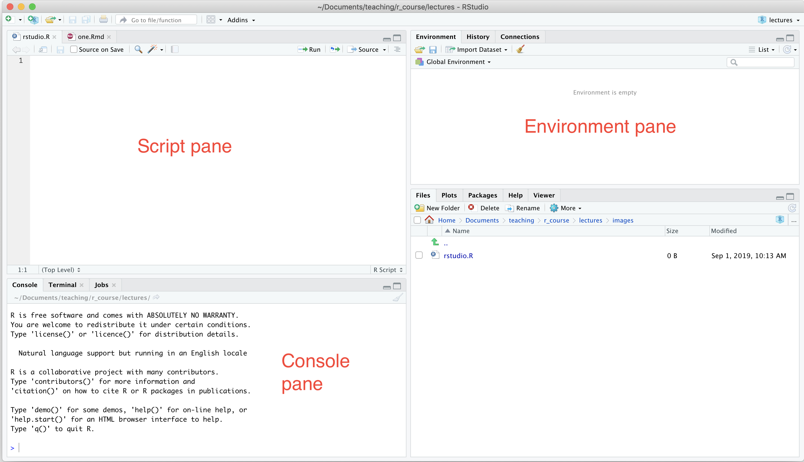

```{r include = FALSE}
knitr::opts_chunk$set(echo = FALSE)
library(viridis)
```

The following R sessions are based on these three texts:

*  Hands-On Programming with R by Garrett Grolemund:
https://rstudio-education.github.io/hopr/ 
* R for Data Science by Garrett Grolemund and Hadley Wickham: https://r4ds.had.co.nz
* Cookbook for R by Winston Chang: http://cookbook-r.com

***
Today's session will cover:

* A
* B

and is based on Chapters 1 - 3 of Hands-On Programming with R by Garrett Grolemund.

***

Quick quiz ...

***
## R and RStudio



***
## R as a calculator

R can be used for simple calculator operations:
```{r echo = TRUE, collapse = TRUE}
1  + 3
```

***
but to make the calculations easier, you can assign numbers to variables:
```{r echo = TRUE, collapse = TRUE}
a <- 1
b <- 4

a + b
a * b
b / a
b - a
```
***
