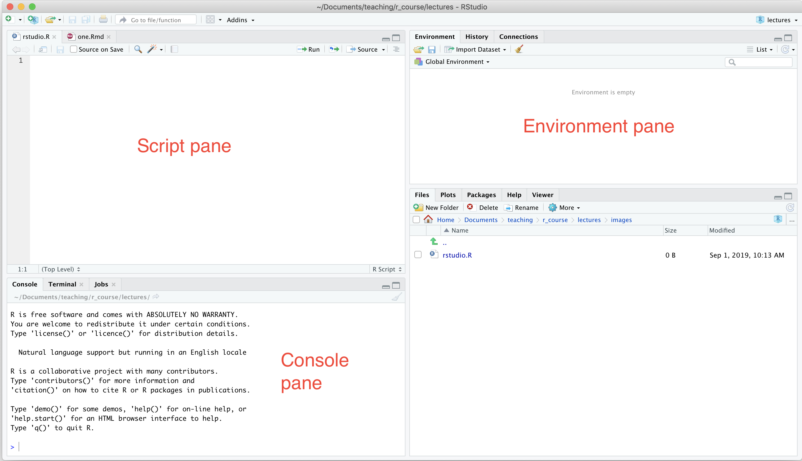

```{r include = FALSE}
knitr::opts_chunk$set(echo = FALSE)
library(viridis)
```

The following R sessions are based on these two texts:

*  Hands-On Programming with R by Garrett Grolemund:
https://rstudio-education.github.io/hopr/ 
* R for Data Science by Garrett Grolemund and Hadley Wickham: https://r4ds.had.co.nz

With two other texts in mind: 

* Cookbook for R by Winston Chang
* The R Software: Fundamentals of Programming and Statistical Analysis by Pierre Lafaye de Micheaux at al.

***
Today's session will cover:

* An introduction into programming in R - making a weighted dice
* Using R as calculator
* Writing and using functions
* Packages
* Quick plots

and is based on Chapters 1 - 3 of Hands-On Programming with R by Garrett Grolemund.

***

Quick quiz ...

https://forms.gle/drXwQ338iy4emUfD6 


***
## R

* Free language for statistical computing and graphics.
* Easier to use than some other languages.
* Effective at handeling and storing data.
* Has lots of inbuilt statistical functions.
* Can produce really nice graphs.

***
## RStudio


***
## Executing code

You can execute code

* in console
* in scripts
* using Rmarkdown (how lectures are done)

***
## R as a calculator

R can be used for simple calculator operations:
```{r echo = TRUE, collapse = TRUE}
```

***
but to make the calculations easier, you can assign numbers to variables.
```{r echo = TRUE, collapse = TRUE}
```

***
## Variable naming 

* Want to name variables short sensible names that descibe what they are.
* R understands capitalisation so `name` and `Name` point to different variables.
* A variable name can't use characters like @, !, $, +, - / or *.
* ```ls()``` tells you what variables you have.


***

## Making the die object and doing algebra with the object
```{r echo = TRUE, collapse = TRUE}
```


***
## Using functions

Some simple functions are inbuilt

```{r echo = TRUE, collapse = TRUE}
# Round

# Factorials

# Mean
```

***
## Rolling a dice 

What function can we use to roll a dice?
```{r echo = TRUE, collapse = TRUE}
# Sampling
```
***
## Rolling a dice in function form
```{r rolling dice, echo = TRUE, collapse = TRUE}
```

## Adding arguments to functions

```{r rolling dice 2, echo = TRUE, collapse = TRUE}
# This won't work as haven't defined bones
roll2 <- function(){
  dice <- sample(bones, size = 2, replace = TRUE)
  sum(dice)
}
```

***
## Packages

You won't always be the only ones writing functions.  You may like to use functions that are written by other people.  These are known as packages.

In this course will use a number of different packages such as ggplot and tidyverse.

***
## Installing packages
```{r echo = TRUE, collapse = TRUE}
# Install ggplot
#install.packages("ggplot")
```

***
## Loading packages
```{r echo = TRUE, collapse = TRUE}
# Loading ggplot
library(ggplot2)
```

***
## Getting help
Each function comes with its own help page.
```{r echo = TRUE, collapse = TRUE}
?qplot
```
If still stuck google or try stack overflow.

***
## Making a quick plot
<div id = "left">
```{r echo = TRUE, collapse = TRUE}
# Plotting a simple polynomial
```


***
## Plotting the dice
```{r echo = TRUE, collapse = TRUE}
# Repeated rolls of the dice (replicate)

# Plot it

```

***
## What about an unfair dice?
```{r echo = TRUE, collapse = TRUE}
roll_unfair <- function(){
  die <- 1:6
  dice <- sample(die, size = 2, replace = TRUE)
  sum(dice)
}

```